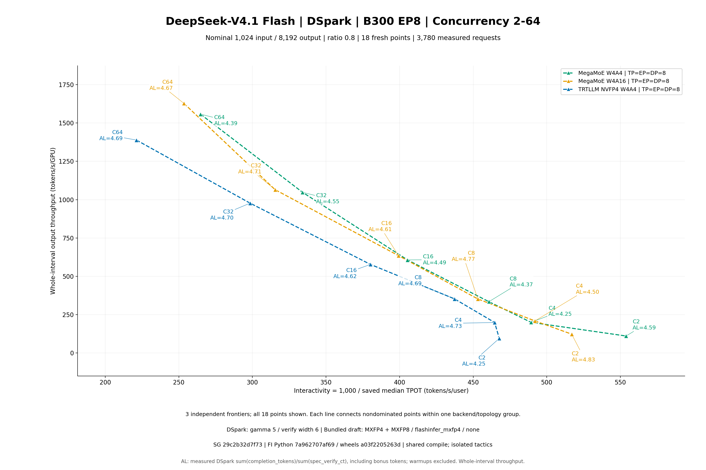

# DeepSeek-V4.1 DSpark EP8 1k/8k results

Verified finalized points: 18/18.

Nominal lengths 1,024/8,192 with ratio 0.8 sampling; 2C warmup / 10C measured. Same-C ordered length arrays match across available arms.

Throughput covers the complete measured wall interval, not separately timed decode. Measured DSpark acceptance length is sum(completion_tokens) / sum(spec_verify_ct), including the native bonus token. Every measured request must retain valid native counters; warmups are excluded.

| Arm | TP=DP=EP | C | Requests | Duration s | Output tok/s | Output tok/s/GPU | 1000/median TPOT | Measured DSpark AL |
|---|---:|---:|---:|---:|---:|---:|---:|---:|
| megamoe-w4a16 | 8 | 16 | 160 | 232.261250 | 5080.171567 | 635.021446 | 399.235819 | 4.612369 |
| megamoe-w4a16 | 8 | 2 | 20 | 148.770398 | 981.821665 | 122.727708 | 516.892401 | 4.830385 |
| megamoe-w4a16 | 8 | 32 | 320 | 278.619058 | 8519.288011 | 1064.911001 | 315.449277 | 4.714787 |
| megamoe-w4a16 | 8 | 4 | 40 | 173.834115 | 1671.029876 | 208.878734 | 491.916499 | 4.496625 |
| megamoe-w4a16 | 8 | 64 | 640 | 362.941887 | 13023.517447 | 1627.939681 | 253.472242 | 4.665568 |
| megamoe-w4a16 | 8 | 8 | 80 | 208.828773 | 2818.768659 | 352.346082 | 453.145119 | 4.771841 |
| megamoe-w4a4 | 8 | 16 | 160 | 243.025224 | 4855.162696 | 606.895337 | 405.407436 | 4.485681 |
| megamoe-w4a4 | 8 | 2 | 20 | 165.153936 | 884.423368 | 110.552921 | 553.844952 | 4.593126 |
| megamoe-w4a4 | 8 | 32 | 320 | 283.147876 | 8383.025982 | 1047.878248 | 334.065658 | 4.545689 |
| megamoe-w4a4 | 8 | 4 | 40 | 181.788581 | 1597.911145 | 199.738893 | 489.301549 | 4.253591 |
| megamoe-w4a4 | 8 | 64 | 640 | 379.286116 | 12462.306949 | 1557.788369 | 264.719243 | 4.388790 |
| megamoe-w4a4 | 8 | 8 | 80 | 220.002427 | 2675.606848 | 334.450856 | 460.644360 | 4.374164 |
| trtllm-w4a4 | 8 | 16 | 160 | 255.417303 | 4619.604809 | 577.450601 | 380.220403 | 4.615761 |
| trtllm-w4a4 | 8 | 2 | 20 | 192.308626 | 759.539510 | 94.942439 | 467.710175 | 4.248575 |
| trtllm-w4a4 | 8 | 32 | 320 | 303.629810 | 7817.532806 | 977.191601 | 298.421965 | 4.695072 |
| trtllm-w4a4 | 8 | 4 | 40 | 182.722148 | 1589.747073 | 198.718384 | 464.567738 | 4.733598 |
| trtllm-w4a4 | 8 | 64 | 640 | 425.425634 | 11110.708002 | 1388.838500 | 221.202598 | 4.688657 |
| trtllm-w4a4 | 8 | 8 | 80 | 208.548546 | 2822.556241 | 352.819530 | 437.298608 | 4.689910 |

Complete saved scalar latency metrics, source pins and raw SHA bindings are in [raw-metrics.csv](raw-metrics.csv) and [raw-metrics.json](raw-metrics.json). All saved scalar fields are retained in raw-saved-scalars.json/CSV; paired-comparisons.json/CSV uses Decimal50 arithmetic and explicit baseline/comparison case IDs. Zero baselines have no percent change.

The traditional arm uses backend defaults for per-tensor activation and quantization fast math; the W4A16 opt-in affects eligible NVFP4 linears. This checkpoint is hybrid: routed target experts are NVFP4, inherited dense layers retain their own precision, and bundled draft MoE is MXFP4/MXFP8. This reader checks sealed settings and accounting; actual native kernel/tactics/calibration, full terminal and preservation acceptance remain separate reviews.

FlashInfer Python-source and installed-wheel commits are reported separately. An optional reviewed single-file Python correction does not imply that cubin/NCCL providers were rebuilt; the original and corrected file hashes are retained in each compact row when present.

Saved ITL is stream_interval30 chunk spacing, not per-token TPOT. Sequential backend/topology/cache history differences do not establish causality or numerical/content equivalence. No unsaved percentiles are reconstructed.

