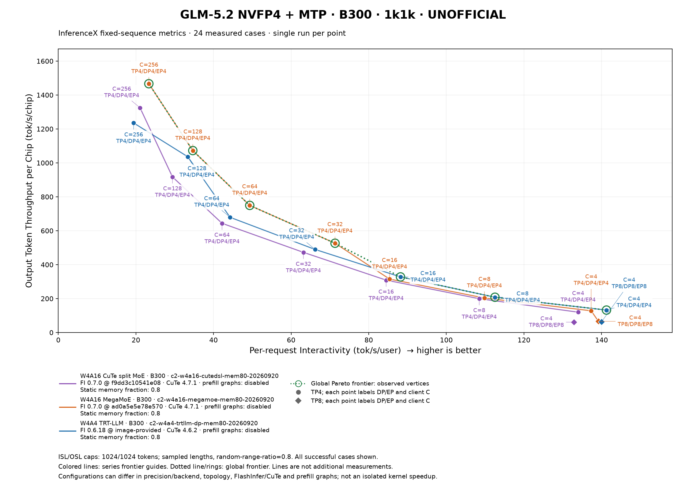
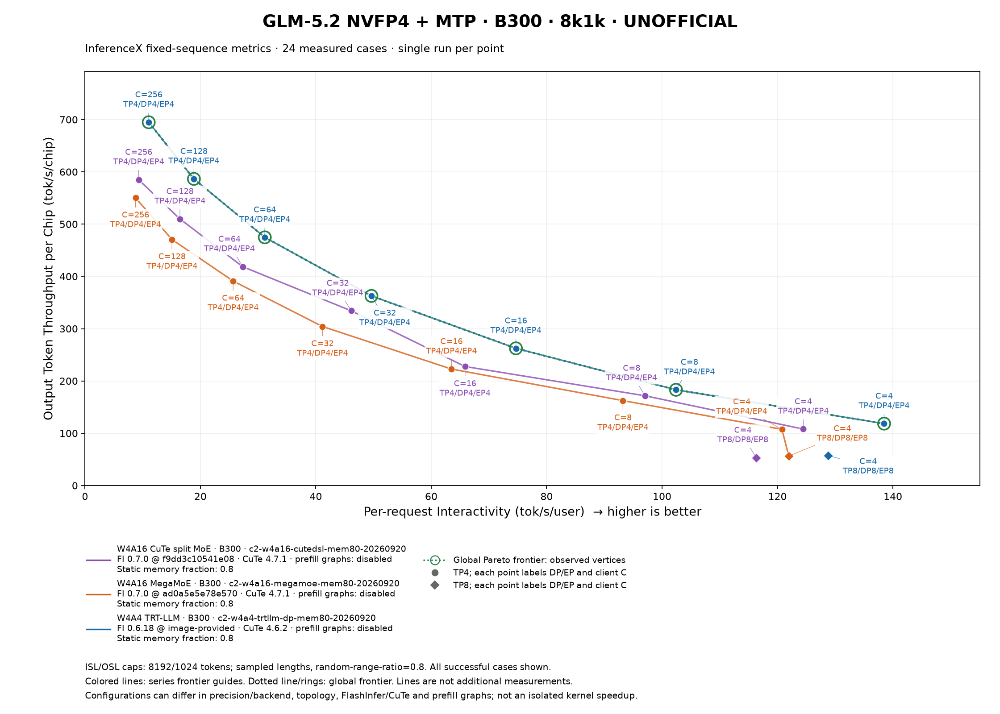
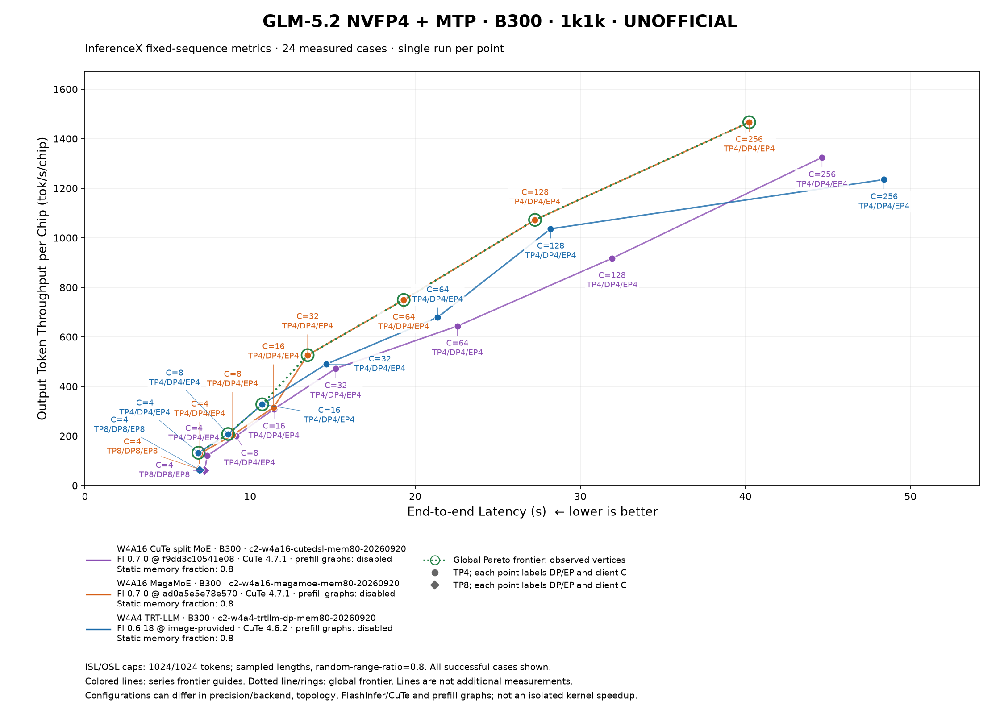
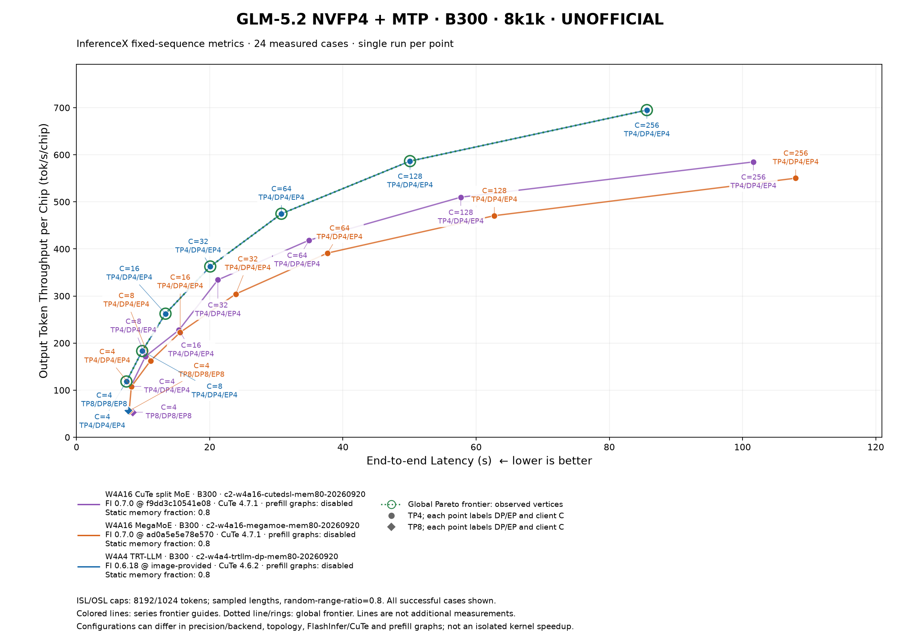

# Unofficial GLM-5.2 B300: InferenceX metric views

This comparison requires TP=DP=EP, disabled prefill CUDA graphs, static memory fraction 0.80, and server max-running-requests=max(client C, TP) for every included case. Historical DP1/EP1 results are excluded and must be plotted separately. Point labels always show client concurrency; TP8/C4 therefore remains C=4.

**48 included cases; 30,720/30,720 successful/requested requests.** Excluded 0 discovered cases. Unstarted cases with no metadata are not counted. These counts do not establish a complete planned matrix.

Each point is one measured run. The workloads are separate: 1k1k and 8k1k specify ISL/OSL caps, with lengths sampled using each case's random-range ratio (0.8 for this experiment). The server GPU count is the denominator, including TP8 points; DP/EP share those GPUs and are not multiplied again. Configurations may differ in precision/backend and FlashInfer/CuTe; topology and prefill policy are governed by the alignment checks stated above. This is not an isolated kernel precision speedup or a latency-SLO result.

## Metric and plotting sources

- [InferenceX fixed-sequence producer](https://github.com/SemiAnalysisAI/InferenceX/blob/8979f7c4cdd2946a02b459d5e62018e41bc02405/infx/results/fixed_sequence.py#L187-L207): `median_e2el = median_e2el_ms / 1000`, `median_intvty = 1000 / median_tpot_ms`, `output_tput_per_gpu = output_throughput / gpu_count`. Interactivity is the reciprocal of the median TPOT, not the mean request rate; TPOT excludes the first token. E2EL includes TTFT.
- [Official x metrics](https://github.com/SemiAnalysisAI/InferenceX-app/blob/b4b72f4f39ad6148f3477dcf67eb6a77257e7bb9/packages/app/src/components/inference/metric-registry.ts#L701-L708) and [fixed-sequence median selection](https://github.com/SemiAnalysisAI/InferenceX-app/blob/b4b72f4f39ad6148f3477dcf67eb6a77257e7bb9/packages/app/src/components/inference/utils/resolveXAxisField.ts#L37-L67): main plots use `median_intvty` in tok/s/user for per-request interactivity; appendix plots use `median_e2el` in seconds.
- [Selected output-only y metric](https://github.com/SemiAnalysisAI/InferenceX-app/blob/b4b72f4f39ad6148f3477dcf67eb6a77257e7bb9/packages/app/src/components/inference/metric-registry.ts#L76-L82): `y_outputTputPerGpu`, tok/s/chip. Total input+output throughput is retained in the table, not substituted for output throughput. This is a selected website metric; the website's default y selection is a cost metric.
- [Series frontier algorithms](https://github.com/SemiAnalysisAI/InferenceX-app/blob/b4b72f4f39ad6148f3477dcf67eb6a77257e7bb9/packages/app/src/lib/chart-utils.ts#L615-L687) and [global frontier](https://github.com/SemiAnalysisAI/InferenceX-app/blob/b4b72f4f39ad6148f3477dcf67eb6a77257e7bb9/packages/app/src/components/inference/utils/global-pareto.ts#L25-L62) are matched by independent dominance predicates, including their original tie rules. E2EL minimizes x and maximizes y; interactivity maximizes both. The global frontier pools all included series separately for each workload and x mode. All successful points remain visible; green rings mark observed frontier coordinates, including coordinate ties.
- [Official point label toggles](https://github.com/SemiAnalysisAI/InferenceX-app/blob/b4b72f4f39ad6148f3477dcf67eb6a77257e7bb9/packages/app/src/components/inference/ui/point-label.ts#L4-L12): this static adaptation always shows concurrency and explicit TP/DP/EP. [Official grouping](https://github.com/SemiAnalysisAI/InferenceX-app/blob/b4b72f4f39ad6148f3477dcf67eb6a77257e7bb9/packages/app/src/components/inference/ui/ScatterGraph.tsx#L1080-L1110) pools topology choices within hardware/precision/run. Accordingly, each arm/runtime/run has one curve across TP/DP/EP choices; shape and point labels identify topology. Colored series lines use straight guides rather than the website's D3 monotone interpolation; the dotted global frontier uses straight observed-vertex segments as on the website. No line claims an additional measurement.

### 1k1k · median_intvty

[SVG](1k1k_output_per_gpu_vs_interactivity_pareto.svg)

### 8k1k · median_intvty

[SVG](8k1k_output_per_gpu_vs_interactivity_pareto.svg)

### 1k1k · median_e2el

[SVG](1k1k_output_per_gpu_vs_e2el_pareto.svg)

### 8k1k · median_e2el

[SVG](8k1k_output_per_gpu_vs_e2el_pareto.svg)

## Measurements

| Case | Scenario | Backend | TP/DP/EP | C | Static memory fraction | Success | median_intvty (tok/s/user) | median_e2el (s) | output_tput_per_gpu (tok/s/chip) | output_throughput (tok/s) | total_token_throughput (tok/s) | Raw |
|---|---|---|---|---:|---:|---:|---:|---:|---:|---:|---:|---|
| P1 | 1k1k | W4A16 CuTe split MoE | 4/4/4 | 4 | 0.8 | 40/40 | 133.955 | 7.407 | 119.994 | 479.978 | 965.696 | [JSON](<../runs/c2-w4a16-cutedsl-mem80-20260920/1k1k/w4a16-cutedsl/tp4_conc4/result.json>) / [metadata](<../runs/c2-w4a16-cutedsl-mem80-20260920/1k1k/w4a16-cutedsl/tp4_conc4/metadata.json>) |
| P2 | 1k1k | W4A16 CuTe split MoE | 4/4/4 | 8 | 0.8 | 80/80 | 108.476 | 9.154 | 199.438 | 797.750 | 1,591.325 | [JSON](<../runs/c2-w4a16-cutedsl-mem80-20260920/1k1k/w4a16-cutedsl/tp4_conc8/result.json>) / [metadata](<../runs/c2-w4a16-cutedsl-mem80-20260920/1k1k/w4a16-cutedsl/tp4_conc8/metadata.json>) |
| P3 | 1k1k | W4A16 CuTe split MoE | 4/4/4 | 16 | 0.8 | 160/160 | 84.482 | 11.447 | 308.876 | 1,235.505 | 2,482.787 | [JSON](<../runs/c2-w4a16-cutedsl-mem80-20260920/1k1k/w4a16-cutedsl/tp4_conc16/result.json>) / [metadata](<../runs/c2-w4a16-cutedsl-mem80-20260920/1k1k/w4a16-cutedsl/tp4_conc16/metadata.json>) |
| P4 | 1k1k | W4A16 CuTe split MoE | 4/4/4 | 32 | 0.8 | 320/320 | 63.163 | 15.191 | 472.571 | 1,890.286 | 3,774.142 | [JSON](<../runs/c2-w4a16-cutedsl-mem80-20260920/1k1k/w4a16-cutedsl/tp4_conc32/result.json>) / [metadata](<../runs/c2-w4a16-cutedsl-mem80-20260920/1k1k/w4a16-cutedsl/tp4_conc32/metadata.json>) |
| P5 | 1k1k | W4A16 CuTe split MoE | 4/4/4 | 64 | 0.8 | 640/640 | 42.193 | 22.555 | 643.768 | 2,575.072 | 5,155.029 | [JSON](<../runs/c2-w4a16-cutedsl-mem80-20260920/1k1k/w4a16-cutedsl/tp4_conc64/result.json>) / [metadata](<../runs/c2-w4a16-cutedsl-mem80-20260920/1k1k/w4a16-cutedsl/tp4_conc64/metadata.json>) |
| P6 | 1k1k | W4A16 CuTe split MoE | 4/4/4 | 128 | 0.8 | 1280/1280 | 29.414 | 31.925 | 917.364 | 3,669.455 | 7,351.209 | [JSON](<../runs/c2-w4a16-cutedsl-mem80-20260920/1k1k/w4a16-cutedsl/tp4_conc128/result.json>) / [metadata](<../runs/c2-w4a16-cutedsl-mem80-20260920/1k1k/w4a16-cutedsl/tp4_conc128/metadata.json>) |
| P7 | 1k1k | W4A16 CuTe split MoE | 4/4/4 | 256 | 0.8 | 2560/2560 | 21.067 | 44.644 | 1,324.609 | 5,298.436 | 10,598.760 | [JSON](<../runs/c2-w4a16-cutedsl-mem80-20260920/1k1k/w4a16-cutedsl/tp4_conc256/result.json>) / [metadata](<../runs/c2-w4a16-cutedsl-mem80-20260920/1k1k/w4a16-cutedsl/tp4_conc256/metadata.json>) |
| P8 | 1k1k | W4A16 CuTe split MoE | 8/8/8 | 4 | 0.8 | 40/40 | 132.888 | 7.241 | 61.015 | 488.123 | 982.084 | [JSON](<../runs/c2-w4a16-cutedsl-mem80-20260920/1k1k/w4a16-cutedsl/tp8_conc4/result.json>) / [metadata](<../runs/c2-w4a16-cutedsl-mem80-20260920/1k1k/w4a16-cutedsl/tp8_conc4/metadata.json>) |
| P9 | 1k1k | W4A16 MegaMoE | 4/4/4 | 4 | 0.8 | 40/40 | 137.328 | 6.949 | 128.056 | 512.225 | 1,030.576 | [JSON](<../runs/c2-w4a16-megamoe-mem80-20260920/1k1k/w4a16-megamoe/tp4_conc4/result.json>) / [metadata](<../runs/c2-w4a16-megamoe-mem80-20260920/1k1k/w4a16-megamoe/tp4_conc4/metadata.json>) |
| P10 | 1k1k | W4A16 MegaMoE | 4/4/4 | 8 | 0.8 | 80/80 | 109.817 | 8.940 | 203.410 | 813.640 | 1,623.021 | [JSON](<../runs/c2-w4a16-megamoe-mem80-20260920/1k1k/w4a16-megamoe/tp4_conc8/result.json>) / [metadata](<../runs/c2-w4a16-megamoe-mem80-20260920/1k1k/w4a16-megamoe/tp4_conc8/metadata.json>) |
| P11 | 1k1k | W4A16 MegaMoE | 4/4/4 | 16 | 0.8 | 160/160 | 85.373 | 11.414 | 315.064 | 1,260.255 | 2,532.523 | [JSON](<../runs/c2-w4a16-megamoe-mem80-20260920/1k1k/w4a16-megamoe/tp4_conc16/result.json>) / [metadata](<../runs/c2-w4a16-megamoe-mem80-20260920/1k1k/w4a16-megamoe/tp4_conc16/metadata.json>) |
| P12 | 1k1k | W4A16 MegaMoE | 4/4/4 | 32 | 0.8 | 320/320 | 71.315 | 13.484 | 526.362 | 2,105.448 | 4,203.735 | [JSON](<../runs/c2-w4a16-megamoe-mem80-20260920/1k1k/w4a16-megamoe/tp4_conc32/result.json>) / [metadata](<../runs/c2-w4a16-megamoe-mem80-20260920/1k1k/w4a16-megamoe/tp4_conc32/metadata.json>) |
| P13 | 1k1k | W4A16 MegaMoE | 4/4/4 | 64 | 0.8 | 640/640 | 49.334 | 19.305 | 749.323 | 2,997.290 | 6,000.267 | [JSON](<../runs/c2-w4a16-megamoe-mem80-20260920/1k1k/w4a16-megamoe/tp4_conc64/result.json>) / [metadata](<../runs/c2-w4a16-megamoe-mem80-20260920/1k1k/w4a16-megamoe/tp4_conc64/metadata.json>) |
| P14 | 1k1k | W4A16 MegaMoE | 4/4/4 | 128 | 0.8 | 1280/1280 | 34.659 | 27.258 | 1,072.480 | 4,289.920 | 8,594.220 | [JSON](<../runs/c2-w4a16-megamoe-mem80-20260920/1k1k/w4a16-megamoe/tp4_conc128/result.json>) / [metadata](<../runs/c2-w4a16-megamoe-mem80-20260920/1k1k/w4a16-megamoe/tp4_conc128/metadata.json>) |
| P15 | 1k1k | W4A16 MegaMoE | 4/4/4 | 256 | 0.8 | 2560/2560 | 23.332 | 40.233 | 1,466.501 | 5,866.005 | 11,734.100 | [JSON](<../runs/c2-w4a16-megamoe-mem80-20260920/1k1k/w4a16-megamoe/tp4_conc256/result.json>) / [metadata](<../runs/c2-w4a16-megamoe-mem80-20260920/1k1k/w4a16-megamoe/tp4_conc256/metadata.json>) |
| P16 | 1k1k | W4A16 MegaMoE | 8/8/8 | 4 | 0.8 | 40/40 | 139.197 | 6.921 | 65.905 | 527.243 | 1,060.791 | [JSON](<../runs/c2-w4a16-megamoe-mem80-20260920/1k1k/w4a16-megamoe/tp8_conc4/result.json>) / [metadata](<../runs/c2-w4a16-megamoe-mem80-20260920/1k1k/w4a16-megamoe/tp8_conc4/metadata.json>) |
| P17 | 1k1k | W4A4 TRT-LLM | 4/4/4 | 4 | 0.8 | 40/40 | 141.276 | 6.870 | 132.286 | 529.143 | 1,064.615 | [JSON](<../runs/c2-w4a4-trtllm-dp-mem80-20260920/1k1k/w4a4-trtllm/tp4_conc4/result.json>) / [metadata](<../runs/c2-w4a4-trtllm-dp-mem80-20260920/1k1k/w4a4-trtllm/tp4_conc4/metadata.json>) |
| P18 | 1k1k | W4A4 TRT-LLM | 4/4/4 | 8 | 0.8 | 80/80 | 112.531 | 8.665 | 208.042 | 832.166 | 1,659.977 | [JSON](<../runs/c2-w4a4-trtllm-dp-mem80-20260920/1k1k/w4a4-trtllm/tp4_conc8/result.json>) / [metadata](<../runs/c2-w4a4-trtllm-dp-mem80-20260920/1k1k/w4a4-trtllm/tp4_conc8/metadata.json>) |
| P19 | 1k1k | W4A4 TRT-LLM | 4/4/4 | 16 | 0.8 | 160/160 | 88.190 | 10.736 | 327.841 | 1,311.365 | 2,635.229 | [JSON](<../runs/c2-w4a4-trtllm-dp-mem80-20260920/1k1k/w4a4-trtllm/tp4_conc16/result.json>) / [metadata](<../runs/c2-w4a4-trtllm-dp-mem80-20260920/1k1k/w4a4-trtllm/tp4_conc16/metadata.json>) |
| P20 | 1k1k | W4A4 TRT-LLM | 4/4/4 | 32 | 0.8 | 320/320 | 66.163 | 14.610 | 489.798 | 1,959.193 | 3,911.721 | [JSON](<../runs/c2-w4a4-trtllm-dp-mem80-20260920/1k1k/w4a4-trtllm/tp4_conc32/result.json>) / [metadata](<../runs/c2-w4a4-trtllm-dp-mem80-20260920/1k1k/w4a4-trtllm/tp4_conc32/metadata.json>) |
| P21 | 1k1k | W4A4 TRT-LLM | 4/4/4 | 64 | 0.8 | 640/640 | 44.277 | 21.360 | 679.053 | 2,716.210 | 5,437.573 | [JSON](<../runs/c2-w4a4-trtllm-dp-mem80-20260920/1k1k/w4a4-trtllm/tp4_conc64/result.json>) / [metadata](<../runs/c2-w4a4-trtllm-dp-mem80-20260920/1k1k/w4a4-trtllm/tp4_conc64/metadata.json>) |
| P22 | 1k1k | W4A4 TRT-LLM | 4/4/4 | 128 | 0.8 | 1280/1280 | 33.362 | 28.202 | 1,036.160 | 4,144.642 | 8,303.177 | [JSON](<../runs/c2-w4a4-trtllm-dp-mem80-20260920/1k1k/w4a4-trtllm/tp4_conc128/result.json>) / [metadata](<../runs/c2-w4a4-trtllm-dp-mem80-20260920/1k1k/w4a4-trtllm/tp4_conc128/metadata.json>) |
| P23 | 1k1k | W4A4 TRT-LLM | 4/4/4 | 256 | 0.8 | 2560/2560 | 19.416 | 48.402 | 1,235.308 | 4,941.234 | 9,884.229 | [JSON](<../runs/c2-w4a4-trtllm-dp-mem80-20260920/1k1k/w4a4-trtllm/tp4_conc256/result.json>) / [metadata](<../runs/c2-w4a4-trtllm-dp-mem80-20260920/1k1k/w4a4-trtllm/tp4_conc256/metadata.json>) |
| P24 | 1k1k | W4A4 TRT-LLM | 8/8/8 | 4 | 0.8 | 40/40 | 140.017 | 6.947 | 63.806 | 510.452 | 1,027.008 | [JSON](<../runs/c2-w4a4-trtllm-dp-mem80-20260920/1k1k/w4a4-trtllm/tp8_conc4/result.json>) / [metadata](<../runs/c2-w4a4-trtllm-dp-mem80-20260920/1k1k/w4a4-trtllm/tp8_conc4/metadata.json>) |
| P25 | 8k1k | W4A16 CuTe split MoE | 4/4/4 | 4 | 0.8 | 40/40 | 124.469 | 8.152 | 107.988 | 431.952 | 3,884.402 | [JSON](<../runs/c2-w4a16-cutedsl-mem80-20260920/8k1k/w4a16-cutedsl/tp4_conc4/result.json>) / [metadata](<../runs/c2-w4a16-cutedsl-mem80-20260920/8k1k/w4a16-cutedsl/tp4_conc4/metadata.json>) |
| P26 | 8k1k | W4A16 CuTe split MoE | 4/4/4 | 8 | 0.8 | 80/80 | 97.039 | 10.351 | 171.712 | 686.846 | 6,112.041 | [JSON](<../runs/c2-w4a16-cutedsl-mem80-20260920/8k1k/w4a16-cutedsl/tp4_conc8/result.json>) / [metadata](<../runs/c2-w4a16-cutedsl-mem80-20260920/8k1k/w4a16-cutedsl/tp4_conc8/metadata.json>) |
| P27 | 8k1k | W4A16 CuTe split MoE | 4/4/4 | 16 | 0.8 | 160/160 | 65.858 | 15.383 | 227.677 | 910.706 | 8,221.882 | [JSON](<../runs/c2-w4a16-cutedsl-mem80-20260920/8k1k/w4a16-cutedsl/tp4_conc16/result.json>) / [metadata](<../runs/c2-w4a16-cutedsl-mem80-20260920/8k1k/w4a16-cutedsl/tp4_conc16/metadata.json>) |
| P28 | 8k1k | W4A16 CuTe split MoE | 4/4/4 | 32 | 0.8 | 320/320 | 46.117 | 21.223 | 334.263 | 1,337.054 | 11,960.707 | [JSON](<../runs/c2-w4a16-cutedsl-mem80-20260920/8k1k/w4a16-cutedsl/tp4_conc32/result.json>) / [metadata](<../runs/c2-w4a16-cutedsl-mem80-20260920/8k1k/w4a16-cutedsl/tp4_conc32/metadata.json>) |
| P29 | 8k1k | W4A16 CuTe split MoE | 4/4/4 | 64 | 0.8 | 640/640 | 27.338 | 34.935 | 418.560 | 1,674.238 | 15,096.659 | [JSON](<../runs/c2-w4a16-cutedsl-mem80-20260920/8k1k/w4a16-cutedsl/tp4_conc64/result.json>) / [metadata](<../runs/c2-w4a16-cutedsl-mem80-20260920/8k1k/w4a16-cutedsl/tp4_conc64/metadata.json>) |
| P30 | 8k1k | W4A16 CuTe split MoE | 4/4/4 | 128 | 0.8 | 1280/1280 | 16.455 | 57.696 | 509.864 | 2,039.455 | 18,418.673 | [JSON](<../runs/c2-w4a16-cutedsl-mem80-20260920/8k1k/w4a16-cutedsl/tp4_conc128/result.json>) / [metadata](<../runs/c2-w4a16-cutedsl-mem80-20260920/8k1k/w4a16-cutedsl/tp4_conc128/metadata.json>) |
| P31 | 8k1k | W4A16 CuTe split MoE | 4/4/4 | 256 | 0.8 | 2560/2560 | 9.304 | 101.632 | 584.828 | 2,339.313 | 21,049.952 | [JSON](<../runs/c2-w4a16-cutedsl-mem80-20260920/8k1k/w4a16-cutedsl/tp4_conc256/result.json>) / [metadata](<../runs/c2-w4a16-cutedsl-mem80-20260920/8k1k/w4a16-cutedsl/tp4_conc256/metadata.json>) |
| P32 | 8k1k | W4A16 CuTe split MoE | 8/8/8 | 4 | 0.8 | 40/40 | 116.317 | 8.415 | 53.237 | 425.900 | 3,829.972 | [JSON](<../runs/c2-w4a16-cutedsl-mem80-20260920/8k1k/w4a16-cutedsl/tp8_conc4/result.json>) / [metadata](<../runs/c2-w4a16-cutedsl-mem80-20260920/8k1k/w4a16-cutedsl/tp8_conc4/metadata.json>) |
| P33 | 8k1k | W4A16 MegaMoE | 4/4/4 | 4 | 0.8 | 40/40 | 120.774 | 8.233 | 107.459 | 429.836 | 3,865.371 | [JSON](<../runs/c2-w4a16-megamoe-mem80-20260920/8k1k/w4a16-megamoe/tp4_conc4/result.json>) / [metadata](<../runs/c2-w4a16-megamoe-mem80-20260920/8k1k/w4a16-megamoe/tp4_conc4/metadata.json>) |
| P34 | 8k1k | W4A16 MegaMoE | 4/4/4 | 8 | 0.8 | 80/80 | 93.224 | 11.108 | 162.419 | 649.678 | 5,781.289 | [JSON](<../runs/c2-w4a16-megamoe-mem80-20260920/8k1k/w4a16-megamoe/tp4_conc8/result.json>) / [metadata](<../runs/c2-w4a16-megamoe-mem80-20260920/8k1k/w4a16-megamoe/tp4_conc8/metadata.json>) |
| P35 | 8k1k | W4A16 MegaMoE | 4/4/4 | 16 | 0.8 | 160/160 | 63.508 | 15.569 | 222.772 | 891.087 | 8,044.756 | [JSON](<../runs/c2-w4a16-megamoe-mem80-20260920/8k1k/w4a16-megamoe/tp4_conc16/result.json>) / [metadata](<../runs/c2-w4a16-megamoe-mem80-20260920/8k1k/w4a16-megamoe/tp4_conc16/metadata.json>) |
| P36 | 8k1k | W4A16 MegaMoE | 4/4/4 | 32 | 0.8 | 320/320 | 41.147 | 23.909 | 304.209 | 1,216.835 | 10,885.287 | [JSON](<../runs/c2-w4a16-megamoe-mem80-20260920/8k1k/w4a16-megamoe/tp4_conc32/result.json>) / [metadata](<../runs/c2-w4a16-megamoe-mem80-20260920/8k1k/w4a16-megamoe/tp4_conc32/metadata.json>) |
| P37 | 8k1k | W4A16 MegaMoE | 4/4/4 | 64 | 0.8 | 640/640 | 25.672 | 37.684 | 391.166 | 1,564.664 | 14,108.630 | [JSON](<../runs/c2-w4a16-megamoe-mem80-20260920/8k1k/w4a16-megamoe/tp4_conc64/result.json>) / [metadata](<../runs/c2-w4a16-megamoe-mem80-20260920/8k1k/w4a16-megamoe/tp4_conc64/metadata.json>) |
| P38 | 8k1k | W4A16 MegaMoE | 4/4/4 | 128 | 0.8 | 1280/1280 | 15.073 | 62.738 | 470.625 | 1,882.498 | 17,001.166 | [JSON](<../runs/c2-w4a16-megamoe-mem80-20260920/8k1k/w4a16-megamoe/tp4_conc128/result.json>) / [metadata](<../runs/c2-w4a16-megamoe-mem80-20260920/8k1k/w4a16-megamoe/tp4_conc128/metadata.json>) |
| P39 | 8k1k | W4A16 MegaMoE | 4/4/4 | 256 | 0.8 | 2560/2560 | 8.757 | 107.984 | 550.249 | 2,200.994 | 19,805.315 | [JSON](<../runs/c2-w4a16-megamoe-mem80-20260920/8k1k/w4a16-megamoe/tp4_conc256/result.json>) / [metadata](<../runs/c2-w4a16-megamoe-mem80-20260920/8k1k/w4a16-megamoe/tp4_conc256/metadata.json>) |
| P40 | 8k1k | W4A16 MegaMoE | 8/8/8 | 4 | 0.8 | 40/40 | 121.960 | 7.911 | 56.231 | 449.849 | 4,045.342 | [JSON](<../runs/c2-w4a16-megamoe-mem80-20260920/8k1k/w4a16-megamoe/tp8_conc4/result.json>) / [metadata](<../runs/c2-w4a16-megamoe-mem80-20260920/8k1k/w4a16-megamoe/tp8_conc4/metadata.json>) |
| P41 | 8k1k | W4A4 TRT-LLM | 4/4/4 | 4 | 0.8 | 40/40 | 138.479 | 7.491 | 118.401 | 473.603 | 4,258.953 | [JSON](<../runs/c2-w4a4-trtllm-dp-mem80-20260920/8k1k/w4a4-trtllm/tp4_conc4/result.json>) / [metadata](<../runs/c2-w4a4-trtllm-dp-mem80-20260920/8k1k/w4a4-trtllm/tp4_conc4/metadata.json>) |
| P42 | 8k1k | W4A4 TRT-LLM | 4/4/4 | 8 | 0.8 | 80/80 | 102.415 | 9.862 | 183.116 | 732.464 | 6,517.981 | [JSON](<../runs/c2-w4a4-trtllm-dp-mem80-20260920/8k1k/w4a4-trtllm/tp4_conc8/result.json>) / [metadata](<../runs/c2-w4a4-trtllm-dp-mem80-20260920/8k1k/w4a4-trtllm/tp4_conc8/metadata.json>) |
| P43 | 8k1k | W4A4 TRT-LLM | 4/4/4 | 16 | 0.8 | 160/160 | 74.674 | 13.361 | 262.413 | 1,049.654 | 9,476.304 | [JSON](<../runs/c2-w4a4-trtllm-dp-mem80-20260920/8k1k/w4a4-trtllm/tp4_conc16/result.json>) / [metadata](<../runs/c2-w4a4-trtllm-dp-mem80-20260920/8k1k/w4a4-trtllm/tp4_conc16/metadata.json>) |
| P44 | 8k1k | W4A4 TRT-LLM | 4/4/4 | 32 | 0.8 | 320/320 | 49.637 | 20.081 | 362.701 | 1,450.804 | 12,978.273 | [JSON](<../runs/c2-w4a4-trtllm-dp-mem80-20260920/8k1k/w4a4-trtllm/tp4_conc32/result.json>) / [metadata](<../runs/c2-w4a4-trtllm-dp-mem80-20260920/8k1k/w4a4-trtllm/tp4_conc32/metadata.json>) |
| P45 | 8k1k | W4A4 TRT-LLM | 4/4/4 | 64 | 0.8 | 640/640 | 31.160 | 30.767 | 474.733 | 1,898.932 | 17,122.736 | [JSON](<../runs/c2-w4a4-trtllm-dp-mem80-20260920/8k1k/w4a4-trtllm/tp4_conc64/result.json>) / [metadata](<../runs/c2-w4a4-trtllm-dp-mem80-20260920/8k1k/w4a4-trtllm/tp4_conc64/metadata.json>) |
| P46 | 8k1k | W4A4 TRT-LLM | 4/4/4 | 128 | 0.8 | 1280/1280 | 18.873 | 50.075 | 586.492 | 2,345.969 | 21,186.851 | [JSON](<../runs/c2-w4a4-trtllm-dp-mem80-20260920/8k1k/w4a4-trtllm/tp4_conc128/result.json>) / [metadata](<../runs/c2-w4a4-trtllm-dp-mem80-20260920/8k1k/w4a4-trtllm/tp4_conc128/metadata.json>) |
| P47 | 8k1k | W4A4 TRT-LLM | 4/4/4 | 256 | 0.8 | 2560/2560 | 11.045 | 85.635 | 694.866 | 2,779.462 | 25,010.572 | [JSON](<../runs/c2-w4a4-trtllm-dp-mem80-20260920/8k1k/w4a4-trtllm/tp4_conc256/result.json>) / [metadata](<../runs/c2-w4a4-trtllm-dp-mem80-20260920/8k1k/w4a4-trtllm/tp4_conc256/metadata.json>) |
| P48 | 8k1k | W4A4 TRT-LLM | 8/8/8 | 4 | 0.8 | 40/40 | 128.753 | 7.772 | 57.519 | 460.151 | 4,137.979 | [JSON](<../runs/c2-w4a4-trtllm-dp-mem80-20260920/8k1k/w4a4-trtllm/tp8_conc4/result.json>) / [metadata](<../runs/c2-w4a4-trtllm-dp-mem80-20260920/8k1k/w4a4-trtllm/tp8_conc4/metadata.json>) |
