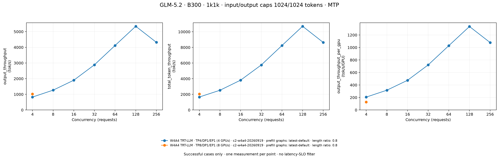
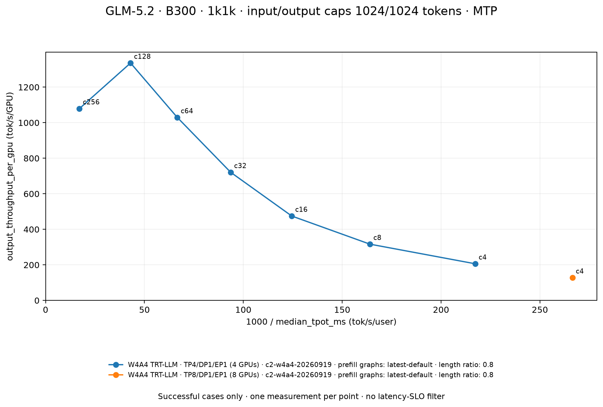
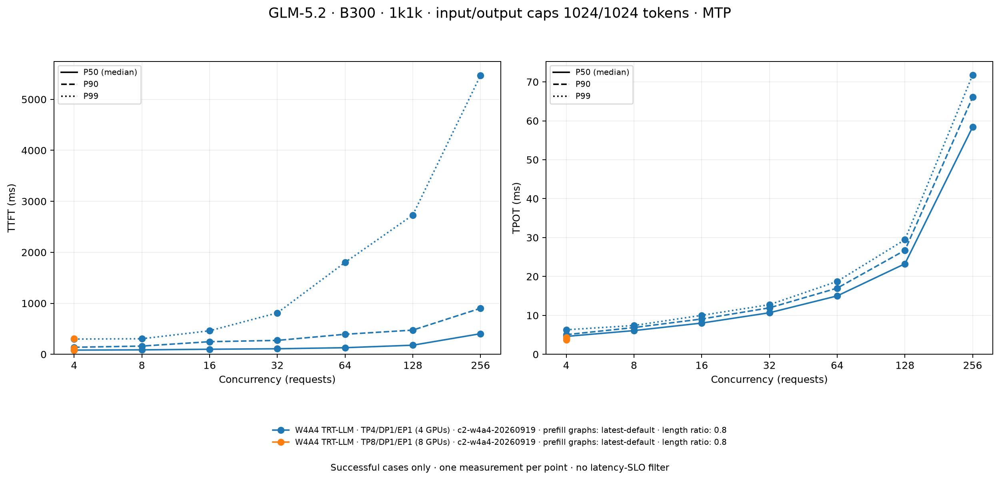
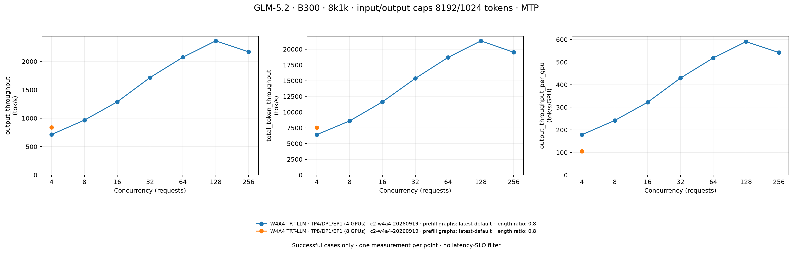
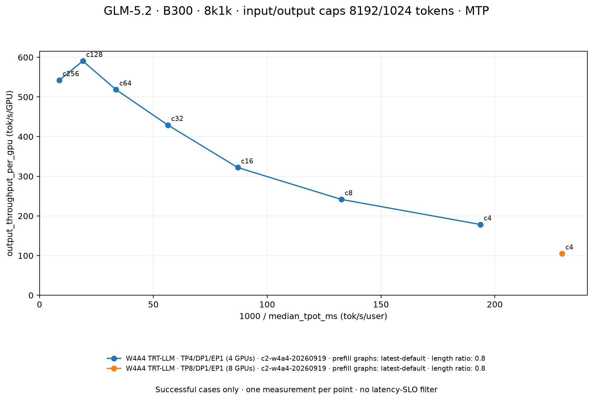
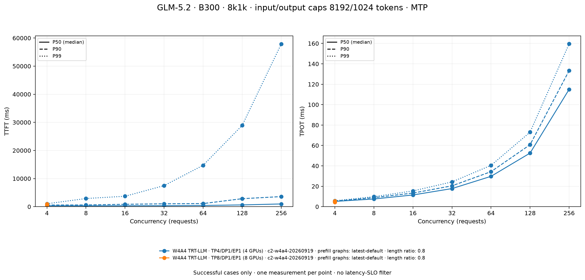

# GLM-5.2 B300 / 1k1k and 8k1k / MTP

Included cases: **16/16 discovered metadata files**. Only completed cases with every requested benchmark request successful are plotted. Discovered failed, missing-result, and still-running cases remain in `summary.json` and the exclusions below. Cases without metadata are not counted; this count does not establish completion of the planned matrix.

Measurements are closed-loop synthetic request-rate=inf runs. Each point is one case, without cross-run averaging or a latency-SLO gate. 1k1k sets input/output caps to 1024/1024 tokens; 8k1k sets them to 8192/1024 tokens. Lengths are sampled using each case's `random_range_ratio`, not fixed to these caps. The sampler draws inclusive integer lengths from floor(ratio × cap) to cap; for chat-template input it first subtracts template overhead, then applies the template and retokenizes. Raw `input_lens` and `output_lens` retain observed request lengths. Workloads are plotted in separate figures. Different topology, GPU count, runtime, backend, or prefill CUDA graph policy configurations are separate series; comparisons are system configurations, not isolated kernel-precision speedups.

`output_throughput` counts generated tokens; `total_token_throughput` counts input plus generated tokens. Both use the benchmark wall duration and are in tok/s. Per-GPU values divide by metadata `gpu_count` (the GPUs used by that server). Interactivity is `1000 / median_tpot_ms` in tok/s/user, excludes the first token, and is not the mean of individual request rates. Latencies retain the raw millisecond units and names; `median_*_ms` is P50. Missing percentiles are shown as —.

| Case | Scenario | Backend | Topology | Concurrency | Completed / requested | output_throughput (tok/s) | total_token_throughput (tok/s) | output_throughput_per_gpu (tok/s/GPU) | Interactivity (tok/s/user) |
|---|---|---|---|---:|---:|---:|---:|---:|---:|
| C1 | 1k1k | W4A4 TRT-LLM | TP4/DP1/EP1 (4 GPUs) | 4 | 40 / 40 | 824.757 | 1,659.376 | 206.189 | 217.304 |
| C2 | 1k1k | W4A4 TRT-LLM | TP4/DP1/EP1 (4 GPUs) | 8 | 80 / 80 | 1,266.181 | 2,525.736 | 316.545 | 164.057 |
| C3 | 1k1k | W4A4 TRT-LLM | TP4/DP1/EP1 (4 GPUs) | 16 | 160 / 160 | 1,899.475 | 3,817.055 | 474.869 | 124.507 |
| C4 | 1k1k | W4A4 TRT-LLM | TP4/DP1/EP1 (4 GPUs) | 32 | 320 / 320 | 2,883.638 | 5,757.467 | 720.909 | 93.620 |
| C5 | 1k1k | W4A4 TRT-LLM | TP4/DP1/EP1 (4 GPUs) | 64 | 640 / 640 | 4,117.105 | 8,242.021 | 1,029.276 | 66.640 |
| C6 | 1k1k | W4A4 TRT-LLM | TP4/DP1/EP1 (4 GPUs) | 128 | 1280 / 1280 | 5,342.922 | 10,703.754 | 1,335.731 | 42.982 |
| C7 | 1k1k | W4A4 TRT-LLM | TP4/DP1/EP1 (4 GPUs) | 256 | 2560 / 2560 | 4,317.192 | 8,635.922 | 1,079.298 | 17.117 |
| C8 | 1k1k | W4A4 TRT-LLM | TP8/DP1/EP1 (8 GPUs) | 4 | 40 / 40 | 1,022.008 | 2,056.239 | 127.751 | 266.431 |
| C9 | 8k1k | W4A4 TRT-LLM | TP4/DP1/EP1 (4 GPUs) | 4 | 40 / 40 | 713.712 | 6,418.171 | 178.428 | 193.676 |
| C10 | 8k1k | W4A4 TRT-LLM | TP4/DP1/EP1 (4 GPUs) | 8 | 80 / 80 | 966.690 | 8,602.290 | 241.673 | 132.603 |
| C11 | 8k1k | W4A4 TRT-LLM | TP4/DP1/EP1 (4 GPUs) | 16 | 160 / 160 | 1,288.139 | 11,629.355 | 322.035 | 87.084 |
| C12 | 8k1k | W4A4 TRT-LLM | TP4/DP1/EP1 (4 GPUs) | 32 | 320 / 320 | 1,716.641 | 15,356.328 | 429.160 | 56.377 |
| C13 | 8k1k | W4A4 TRT-LLM | TP4/DP1/EP1 (4 GPUs) | 64 | 640 / 640 | 2,073.626 | 18,697.952 | 518.406 | 33.624 |
| C14 | 8k1k | W4A4 TRT-LLM | TP4/DP1/EP1 (4 GPUs) | 128 | 1280 / 1280 | 2,362.354 | 21,334.825 | 590.588 | 19.034 |
| C15 | 8k1k | W4A4 TRT-LLM | TP4/DP1/EP1 (4 GPUs) | 256 | 2560 / 2560 | 2,168.794 | 19,515.564 | 542.198 | 8.695 |
| C16 | 8k1k | W4A4 TRT-LLM | TP8/DP1/EP1 (8 GPUs) | 4 | 40 / 40 | 840.182 | 7,555.472 | 105.023 | 229.551 |

| Case | Scenario | median_ttft_ms | p90_ttft_ms | p99_ttft_ms | median_tpot_ms | p90_tpot_ms | p99_tpot_ms |
|---|---|---:|---:|---:|---:|---:|---:|
| C1 | 1k1k | 82.610 | 138.237 | 298.838 | 4.602 | 5.052 | 6.302 |
| C2 | 1k1k | 87.426 | 161.479 | 305.239 | 6.095 | 6.878 | 7.401 |
| C3 | 1k1k | 99.596 | 247.719 | 461.474 | 8.032 | 9.076 | 10.022 |
| C4 | 1k1k | 108.759 | 272.980 | 811.861 | 10.682 | 11.945 | 12.756 |
| C5 | 1k1k | 129.698 | 393.100 | 1,802.130 | 15.006 | 17.002 | 18.730 |
| C6 | 1k1k | 178.685 | 474.547 | 2,731.166 | 23.265 | 26.726 | 29.450 |
| C7 | 1k1k | 404.357 | 902.720 | 5,469.784 | 58.422 | 66.072 | 71.803 |
| C8 | 1k1k | 76.750 | 117.828 | 304.601 | 3.753 | 4.125 | 4.290 |
| C9 | 8k1k | 314.526 | 583.669 | 1,040.110 | 5.163 | 5.552 | 5.801 |
| C10 | 8k1k | 312.770 | 612.454 | 2,907.281 | 7.541 | 8.844 | 9.808 |
| C11 | 8k1k | 332.124 | 849.812 | 3,711.872 | 11.483 | 13.337 | 15.451 |
| C12 | 8k1k | 350.855 | 1,025.629 | 7,496.370 | 17.738 | 20.432 | 24.284 |
| C13 | 8k1k | 434.083 | 1,109.967 | 14,729.332 | 29.741 | 34.329 | 40.489 |
| C14 | 8k1k | 624.823 | 2,843.056 | 28,911.712 | 52.538 | 60.750 | 73.048 |
| C15 | 8k1k | 972.407 | 3,590.959 | 57,855.886 | 115.008 | 133.341 | 159.566 |
| C16 | 8k1k | 277.777 | 481.785 | 907.362 | 4.356 | 4.952 | 5.453 |

## Workload accounting

| Case | Scenario | random_range_ratio | input_lens min / mean / max (tokens) | output_lens min / mean / max (tokens) |
|---|---|---:|---:|---:|
| C1 | 1k1k | 0.800 | 830.000 / 928.700 / 1,018.000 | 820.000 / 917.725 / 1,022.000 |
| C2 | 1k1k | 0.800 | 822.000 / 924.212 / 1,024.000 | 819.000 / 929.075 / 1,024.000 |
| C3 | 1k1k | 0.800 | 821.000 / 925.419 / 1,024.000 | 819.000 / 916.681 / 1,024.000 |
| C4 | 1k1k | 0.800 | 821.000 / 921.087 / 1,024.000 | 819.000 / 924.231 / 1,024.000 |
| C5 | 1k1k | 0.800 | 821.000 / 923.388 / 1,024.000 | 819.000 / 921.639 / 1,024.000 |
| C6 | 1k1k | 0.800 | 821.000 / 923.237 / 1,024.000 | 819.000 / 920.153 / 1,024.000 |
| C7 | 1k1k | 0.800 | 821.000 / 922.223 / 1,024.000 | 819.000 / 921.895 / 1,024.000 |
| C8 | 1k1k | 0.800 | 830.000 / 928.700 / 1,018.000 | 820.000 / 917.725 / 1,022.000 |
| C9 | 8k1k | 0.800 | 6,628.000 / 7,354.250 / 8,180.000 | 820.000 / 920.125 / 1,022.000 |
| C10 | 8k1k | 0.800 | 6,584.000 / 7,313.113 / 8,180.000 | 819.000 / 925.862 / 1,024.000 |
| C11 | 8k1k | 0.800 | 6,567.000 / 7,346.950 / 8,190.000 | 819.000 / 915.163 / 1,024.000 |
| C12 | 8k1k | 0.800 | 6,567.000 / 7,353.203 / 8,190.000 | 819.000 / 925.447 / 1,024.000 |
| C13 | 8k1k | 0.800 | 6,556.000 / 7,389.788 / 8,190.000 | 819.000 / 921.761 / 1,024.000 |
| C14 | 8k1k | 0.800 | 6,556.000 / 7,388.623 / 8,192.000 | 819.000 / 919.993 / 1,024.000 |
| C15 | 8k1k | 0.800 | 6,556.000 / 7,374.516 / 8,192.000 | 819.000 / 922.005 / 1,024.000 |
| C16 | 8k1k | 0.800 | 6,628.000 / 7,354.250 / 8,180.000 | 820.000 / 920.125 / 1,022.000 |

## Provenance

| Case | Run | Raw results and metadata | Model | Image | SGLang commit | Prefill CUDA graph policy |
|---|---|---|---|---|---|---|
| C1 | c2-w4a4-20260919 | [raw](<../1k1k/w4a4-trtllm/tp4_conc4/result.json>) / [metadata](<../1k1k/w4a4-trtllm/tp4_conc4/metadata.json>) | nvidia/GLM-5.2-NVFP4 | lmsysorg/sglang:nightly-dev-cu13-20260918-20518d85 | 50eeb742961908afa68f4f523a1a19c5de6eb0b3 | latest-default |
| C2 | c2-w4a4-20260919 | [raw](<../1k1k/w4a4-trtllm/tp4_conc8/result.json>) / [metadata](<../1k1k/w4a4-trtllm/tp4_conc8/metadata.json>) | nvidia/GLM-5.2-NVFP4 | lmsysorg/sglang:nightly-dev-cu13-20260918-20518d85 | 50eeb742961908afa68f4f523a1a19c5de6eb0b3 | latest-default |
| C3 | c2-w4a4-20260919 | [raw](<../1k1k/w4a4-trtllm/tp4_conc16/result.json>) / [metadata](<../1k1k/w4a4-trtllm/tp4_conc16/metadata.json>) | nvidia/GLM-5.2-NVFP4 | lmsysorg/sglang:nightly-dev-cu13-20260918-20518d85 | 50eeb742961908afa68f4f523a1a19c5de6eb0b3 | latest-default |
| C4 | c2-w4a4-20260919 | [raw](<../1k1k/w4a4-trtllm/tp4_conc32/result.json>) / [metadata](<../1k1k/w4a4-trtllm/tp4_conc32/metadata.json>) | nvidia/GLM-5.2-NVFP4 | lmsysorg/sglang:nightly-dev-cu13-20260918-20518d85 | 50eeb742961908afa68f4f523a1a19c5de6eb0b3 | latest-default |
| C5 | c2-w4a4-20260919 | [raw](<../1k1k/w4a4-trtllm/tp4_conc64/result.json>) / [metadata](<../1k1k/w4a4-trtllm/tp4_conc64/metadata.json>) | nvidia/GLM-5.2-NVFP4 | lmsysorg/sglang:nightly-dev-cu13-20260918-20518d85 | 50eeb742961908afa68f4f523a1a19c5de6eb0b3 | latest-default |
| C6 | c2-w4a4-20260919 | [raw](<../1k1k/w4a4-trtllm/tp4_conc128/result.json>) / [metadata](<../1k1k/w4a4-trtllm/tp4_conc128/metadata.json>) | nvidia/GLM-5.2-NVFP4 | lmsysorg/sglang:nightly-dev-cu13-20260918-20518d85 | 50eeb742961908afa68f4f523a1a19c5de6eb0b3 | latest-default |
| C7 | c2-w4a4-20260919 | [raw](<../1k1k/w4a4-trtllm/tp4_conc256/result.json>) / [metadata](<../1k1k/w4a4-trtllm/tp4_conc256/metadata.json>) | nvidia/GLM-5.2-NVFP4 | lmsysorg/sglang:nightly-dev-cu13-20260918-20518d85 | 50eeb742961908afa68f4f523a1a19c5de6eb0b3 | latest-default |
| C8 | c2-w4a4-20260919 | [raw](<../1k1k/w4a4-trtllm/tp8_conc4/result.json>) / [metadata](<../1k1k/w4a4-trtllm/tp8_conc4/metadata.json>) | nvidia/GLM-5.2-NVFP4 | lmsysorg/sglang:nightly-dev-cu13-20260918-20518d85 | 50eeb742961908afa68f4f523a1a19c5de6eb0b3 | latest-default |
| C9 | c2-w4a4-20260919 | [raw](<../8k1k/w4a4-trtllm/tp4_conc4/result.json>) / [metadata](<../8k1k/w4a4-trtllm/tp4_conc4/metadata.json>) | nvidia/GLM-5.2-NVFP4 | lmsysorg/sglang:nightly-dev-cu13-20260918-20518d85 | 50eeb742961908afa68f4f523a1a19c5de6eb0b3 | latest-default |
| C10 | c2-w4a4-20260919 | [raw](<../8k1k/w4a4-trtllm/tp4_conc8/result.json>) / [metadata](<../8k1k/w4a4-trtllm/tp4_conc8/metadata.json>) | nvidia/GLM-5.2-NVFP4 | lmsysorg/sglang:nightly-dev-cu13-20260918-20518d85 | 50eeb742961908afa68f4f523a1a19c5de6eb0b3 | latest-default |
| C11 | c2-w4a4-20260919 | [raw](<../8k1k/w4a4-trtllm/tp4_conc16/result.json>) / [metadata](<../8k1k/w4a4-trtllm/tp4_conc16/metadata.json>) | nvidia/GLM-5.2-NVFP4 | lmsysorg/sglang:nightly-dev-cu13-20260918-20518d85 | 50eeb742961908afa68f4f523a1a19c5de6eb0b3 | latest-default |
| C12 | c2-w4a4-20260919 | [raw](<../8k1k/w4a4-trtllm/tp4_conc32/result.json>) / [metadata](<../8k1k/w4a4-trtllm/tp4_conc32/metadata.json>) | nvidia/GLM-5.2-NVFP4 | lmsysorg/sglang:nightly-dev-cu13-20260918-20518d85 | 50eeb742961908afa68f4f523a1a19c5de6eb0b3 | latest-default |
| C13 | c2-w4a4-20260919 | [raw](<../8k1k/w4a4-trtllm/tp4_conc64/result.json>) / [metadata](<../8k1k/w4a4-trtllm/tp4_conc64/metadata.json>) | nvidia/GLM-5.2-NVFP4 | lmsysorg/sglang:nightly-dev-cu13-20260918-20518d85 | 50eeb742961908afa68f4f523a1a19c5de6eb0b3 | latest-default |
| C14 | c2-w4a4-20260919 | [raw](<../8k1k/w4a4-trtllm/tp4_conc128/result.json>) / [metadata](<../8k1k/w4a4-trtllm/tp4_conc128/metadata.json>) | nvidia/GLM-5.2-NVFP4 | lmsysorg/sglang:nightly-dev-cu13-20260918-20518d85 | 50eeb742961908afa68f4f523a1a19c5de6eb0b3 | latest-default |
| C15 | c2-w4a4-20260919 | [raw](<../8k1k/w4a4-trtllm/tp4_conc256/result.json>) / [metadata](<../8k1k/w4a4-trtllm/tp4_conc256/metadata.json>) | nvidia/GLM-5.2-NVFP4 | lmsysorg/sglang:nightly-dev-cu13-20260918-20518d85 | 50eeb742961908afa68f4f523a1a19c5de6eb0b3 | latest-default |
| C16 | c2-w4a4-20260919 | [raw](<../8k1k/w4a4-trtllm/tp8_conc4/result.json>) / [metadata](<../8k1k/w4a4-trtllm/tp8_conc4/metadata.json>) | nvidia/GLM-5.2-NVFP4 | lmsysorg/sglang:nightly-dev-cu13-20260918-20518d85 | 50eeb742961908afa68f4f523a1a19c5de6eb0b3 | latest-default |

Metadata retains model revision, installed package versions, and environment settings.

## Excluded cases

None among discovered cases. This does not prove that every planned case was launched.

[SVG](1k1k_throughput_concurrency.svg)

[SVG](1k1k_throughput_interactivity.svg)

[SVG](1k1k_latency_concurrency.svg)

[SVG](8k1k_throughput_concurrency.svg)

[SVG](8k1k_throughput_interactivity.svg)

[SVG](8k1k_latency_concurrency.svg)

中文

仅汇总已经写出 metadata.json 的实验；仅将全部请求成功的完成项纳入图表。失败、缺失结果和运行中的实验保留在 JSON 与排除列表中。输出吞吐只计算生成 token，总吞吐同时计算输入与生成 token。延迟保持毫秒单位；median 为 P50。交互性为 1000 / median_tpot_ms，不包含首个 token，也不代表满足某项延迟 SLO。1k1k 和 8k1k 表示配置的长度上限，实际长度按 random_range_ratio 采样，并非每个请求都等于上限。输入还包含聊天模板与重新分词的影响；表中列出实际输入和输出长度。两种负载分别绘图。不同拓扑、GPU 数量和运行环境分别展示，不能解释为单独改变内核精度的收益。汇总数量仅代表发现的 metadata 文件，不证明计划矩阵已完成。

