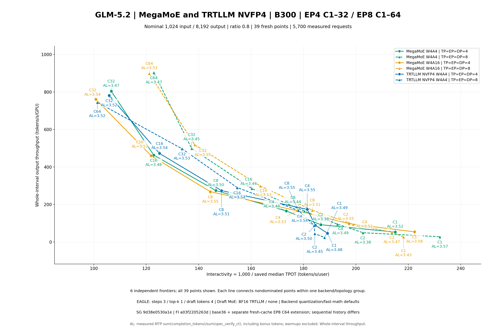

# GLM-5.2 实测 MTP：EP4 C1–32 与 EP8 C1–64

[English](README.md) | **中文**

新增三个 EP8 C64 实测点后，原 36 点扩展为 **39 点、5,700 个成功测量请求、0 个测量失败**。1,140 个计划预热请求不进入 MTP 统计；预热输出已丢弃，因此不声称逐预热成功审计。原 36 行数据及 C2–32 目录内全部 13 个文件逐字节保留。没有 EP4 C64 测量。

## 结果

| 新增 EP8 C64 后端 | 测量请求 | 测量区间 (s) | 输出 tokens/s/GPU | 1,000 / median TPOT | 实测 AL | 接受率 |
|---|---:|---:|---:|---:|---:|---:|
| MegaMoE W4A16 | 640 | 657.860377 | 898.231063 | 121.162281 | 3.533377831 | 0.844511100 |
| MegaMoE W4A4 | 640 | 654.374923 | 903.015389 | 122.926009 | 3.474205196 | 0.824809048 |
| TRTLLM W4A4 | 640 | 793.520819 | 744.669340 | 101.320310 | 3.519084691 | 0.839766361 |

每个 C64 后端均有 590,968 个输入 token 和 4,727,285 个输出 token，三个后端的 640 条有序请求长度及完成长度数组完全相同。汇总表保留已保存的延迟尾部指标及所有有符号退化。共有 57 组配对比较（39 组后端、18 组拓扑），即 1,710 条指标行。C64 仅新增三组后端比较，不新增拓扑比较。

[39 点指标](raw-metrics.csv) · [保存的标量](raw-saved-scalars.csv) · [57 组比较](paired-comparisons.csv) · [配置与来源](PROVENANCE.json)

| 视图 | 点数 / 测量请求 | PNG | SVG |
|---|---:|---|---|
| EP4 C1–32 / EP8 C1–64 合并 | 39 / 5,700 | [PNG](pareto.png) | [SVG](pareto.svg) |
| EP4 C1–32 | 18 / 1,890 | [PNG](figures/ep4/pareto.png) | [SVG](figures/ep4/pareto.svg) |
| EP8 C1–64 | 21 / 3,810 | [PNG](figures/ep8/pareto.png) | [SVG](figures/ep8/pareto.svg) |
| 原 C2–32，保持不变 | 30 / 3,720 | [PNG](c2-32/pareto.png) | [SVG](c2-32/pareto.svg) |



绿、橙、蓝分别表示 MegaMoE W4A4、W4A16、TRTLLM W4A4。合并图用实线圆点表示 EP4、虚线三角表示 EP8，绘制六条独立前沿；单拓扑图分别绘制三条后端前沿。每点标注并发与实测 AL。

## 从公开表格重绘

需要 Python 3.11+ 和 Matplotlib。在本目录运行，输出路径必须尚不存在：

```sh
python3 -B render39.py --bundle . --output /absolute/path/to/new-39-plots
python3 -B render_concurrency_subset.py --source-root source --metrics base36-raw-metrics.json --min-concurrency 2 --output /absolute/path/to/new-original-c2-32-replay
```

C2–32 重绘特意使用 `base36-raw-metrics.json`；若传入合并表，其仅限制最小并发的筛选器会误纳 C64。公开重现仅重绘汇总表和图；完整 server/client/setup 日志、请求数组、原生记录、进程归属与详细验证保留本地，无法通过公开重绘复验。导出的 `join39.py` 记录本地合并方法；重建该合并还需要本地原始证据和原有 source/base locks。不同渲染环境的图片字节可能不同，但坐标、case 标识和非支配成员应一致。

## 工作负载与运行环境

- 标称 1,024 输入 / 8,192 输出 token；长度比例 0.8、seed 0、chat template、无限请求速率。每点先安排 `2C` 预热，再执行 `10C` 测量。扩展在相同八卡 B300 节点上串行运行 Mega W4A4、Mega W4A16、TRT W4A4。
- C64 使用 TP=EP=DP attention=8；target 为 `bfloat16` / `modelopt_fp4`，KV 为 `fp8_e4m3`，memory fraction 0.8。全局 chunk/max-prefill 为 32,768，本地解析后 chunk 为 4,096。禁用 radix/prefill graphs。Target verification 使用 width 4、batch 1–8；日志中的 draft decode/extend capture 分别为 width 1/4、batch 1–8。
- 真实 EAGLE：3 steps、top-k 1、4 draft tokens；draft MoE 为 BF16 TRTLLM/none。AL = `sum(completion_tokens)/sum(spec_verify_ct)`；接受率 = `sum(correct_drafts)/sum(proposed_drafts)`，均排除预热。保留原生 bonus 语义，不假设 `completion_tokens = correct_drafts + spec_verify_ct`，不平均逐请求或逐 rank 比值。
- x = `1000/median_tpot_ms`；y = 输出 token / 完整测量区间 / GPU 数量，不是单独计时的 decode 吞吐。保存的 ITL 是 interval 30 的流式 chunk 间隔。
- 扩展 recipe `d11577979d1b7658fdaa7f5a2a2f8fdb104378f2`；SGLang `9d38e0530a1e35d1756a7fabf044bc39b77209b8`；FlashInfer `a03f2205263d4e691d68e485bff287e37a19b6c3`；Torch `2.13.0+cu130`；checkpoint revision `53e0691e21895a3863a606dfd12910c69eba94ab`。
- 镜像：`lmsysorg/sglang:nightly-dev-cu13-20260930-cae69be5@sha256:0412c5b792cb35706de0359de4a1af52c160d4bdef6ff7530baf9df4e2a7b0b4`。

## 证据边界

Case、原生指标、数组与原始内外层终态均通过审核。三个 C64 case 的 benchmark client 返回 0；server 在测量后终止并返回 -9，已记录进程清理完成。这不等于 server 优雅退出或持续／当前 GPU 空闲证明。默认 INFO 日志没有提供每个 kernel 的直接原生 rank/PID/config 对应关系。

复用相同已安装环境和 checkpoint，没有重新安装或 cache seed。C64 使用新的 run/HOME/TMP/compile/tactic 目录，因此顺序缓存历史不同于原 36 点。扩展内部共享编译、按后端分离 tactics；不声称 provider/system-default 缓存冷启动或完全隔离。W4A16 同时影响符合条件的 dense NVFP4 linears；BF16 draft 仅指 MoE 路线，不代表全部 tensor。没有新增 per-token、quantizer-fast-math、combine 或 IKR override。TRT 的 FI quantizer 默认为 CUDA；仅用于 CuTeDSL 的开关不能证明 CUDA 路线的数学行为。

原安装失败和成功续检分别保留，仍保留 14 行涉及依赖冲突／缺失依赖的 pip check 输出。真实手动 matrix 验证因 experimental key 未注册而失败；这些结果不代表 scheduled sweep、eval 或 reuse 资格。历史 9 月 29 日的 measured-only AL 仍不可用。单次串行测量不能证明质量／数值等价、显著性、独立因果或通用 cache hit/dispatch。本地选定归档及持久保留另行跟踪；不声称全容器或 installed-RECORD 一致、tensor SHA 或节点删除完成。DFlash 根据用户决定暂停，保留相同节点。
