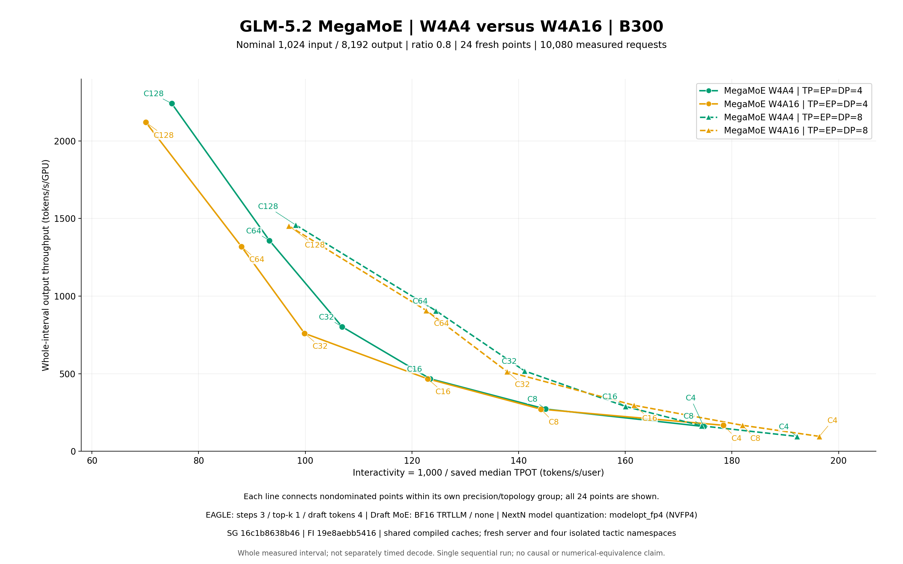

# GLM-5.2 MegaMoE W4A4 versus W4A16: fresh 1k/8k campaign

@humansand

**All 24 inputs are released by the bound root case, comparison and terminal acceptance evidence.**

The corrected R2 run contains 24 fresh serving measurements and 10,080 successful measured requests with zero measured failures. It compares NVFP4 W4A4 and W4A16 at TP=EP=DP-attention 4 and 8, across client concurrency 4, 8, 16, 32, 64 and 128. Each of the four series has six nondominated points.



[Vector figure](pareto.svg) | [Full raw scalar CSV](raw-saved-scalars.csv) | [Derived metrics CSV](raw-metrics.csv) | [All saved latency tables](SAVED_LATENCIES.md) | [All 24 paired comparisons](PAIRED_COMPARISONS.md)

## Metrics and evidence

- **Throughput:** measured completed output tokens / complete measured wall interval / actual GPUs (4 or 8). The unchanged client derives duration from the monotonic time.perf_counter clock. Separately recorded Unix start/end timestamps are phase evidence and can differ slightly from that duration. This interval excludes startup and warmup, includes serving and client completion, and is not separately timed decode throughput.
- **Interactivity:** 1,000 / the client's saved median TPOT in milliseconds; this is a median-based reciprocal, not the mean of per-user rates.
- **Latency:** all original mean, median, standard deviation, p90, p99 and p99.9 TTFT, TPOT, ITL and end-to-end scalars are retained. The client did not save per-request latency arrays, so percentiles cannot be independently reconstructed. ITL measures streamed chunk spacing at stream_interval=30, not individual-token TPOT.
- **Length control:** all four arms have exactly matching ordered requested and completed input/output length arrays at each concurrency. Actual completed output lengths are 6,553 through 8,192. Nominal 1k/8k labels are not constant lengths; the unchanged client includes chat-template accounting and ratio-0.8 sampling. This establishes token-count parity, not content or numerical equivalence.
- **Evidence:** the frozen reader verifies complete manifests, cleanup, settings, source/package equality, request lengths and the full 24-point worker report. Separate independent case/comparison reviews and exact outer/inner waited terminal reviews are required; a structural reader pass is insufficient on its own. Root snapshots are reserialized and do not replace exact terminal archives.

## Raw totals and chart coordinates

| Precision | TP=EP=DP | C | Measured / warmup | Input tokens | Output tokens | Duration s | Output tok/s | Output tok/s/GPU | Median TPOT ms | 1,000 / median TPOT |
|---|---|---|---|---|---|---|---|---|---|---|
| W4A4 | 4 | 4 | 40 / 8 | 37148 | 290482 | 456.0760755040683 | 636.915671753 | 159.228917938 | 5.723325503952552 | 174.723593706 |
| W4A4 | 4 | 8 | 80 / 16 | 73937 | 588640 | 541.5900072851218 | 1086.873819830 | 271.718454958 | 6.892697014155176 | 145.081090602 |
| W4A4 | 4 | 16 | 160 / 32 | 148067 | 1179960 | 631.4630752750672 | 1868.612823459 | 467.153205865 | 8.1034911212928 | 123.403602846 |
| W4A4 | 4 | 32 | 320 / 64 | 294748 | 2373563 | 739.7185411113314 | 3208.738010587 | 802.184502647 | 9.353322611891535 | 106.913878789 |
| W4A4 | 4 | 64 | 640 / 128 | 590968 | 4727285 | 870.1409717127681 | 5432.780611048 | 1358.195152762 | 10.719237951421652 | 93.290213776 |
| W4A4 | 4 | 128 | 1280 / 256 | 1181744 | 9428519 | 1051.3382067200728 | 8968.112201891 | 2242.028050473 | 13.341156584815453 | 74.956020015 |
| W4A16 | 4 | 4 | 40 / 8 | 37148 | 290482 | 434.5755269480869 | 668.426963755 | 167.106740939 | 5.6050460965705025 | 178.410664742 |
| W4A16 | 4 | 8 | 80 / 16 | 73937 | 588640 | 542.9567544953898 | 1084.137908086 | 271.034477022 | 6.935837895334174 | 144.178686857 |
| W4A16 | 4 | 16 | 160 / 32 | 148067 | 1179960 | 632.004141418729 | 1867.013082147 | 466.753270537 | 8.134201538409307 | 122.937696500 |
| W4A16 | 4 | 32 | 320 / 64 | 294748 | 2373563 | 780.9569979058579 | 3039.300507409 | 759.825126852 | 10.013804306043074 | 99.862147236 |
| W4A16 | 4 | 64 | 640 / 128 | 590968 | 4727285 | 895.8328133220784 | 5276.972365490 | 1319.243091373 | 11.358943488167053 | 88.036356642 |
| W4A16 | 4 | 128 | 1280 / 256 | 1181744 | 9428519 | 1111.4335248582065 | 8483.205508132 | 2120.801377033 | 14.264940484831302 | 70.101939862 |
| W4A4 | 8 | 4 | 40 / 8 | 37148 | 290482 | 381.00478667160496 | 762.410369008 | 95.301296126 | 5.20259247829561 | 192.211864406 |
| W4A4 | 8 | 8 | 80 / 16 | 73937 | 588640 | 450.5899540418759 | 1306.376217933 | 163.297027242 | 5.7359522359565265 | 174.338969166 |
| W4A4 | 8 | 16 | 160 / 32 | 148067 | 1179960 | 511.66867648018524 | 2306.101690877 | 288.262711360 | 6.247321562493308 | 160.068597398 |
| W4A4 | 8 | 32 | 320 / 64 | 294748 | 2373563 | 573.5268715908751 | 4138.538432238 | 517.317304030 | 7.085056650960196 | 141.142131851 |
| W4A4 | 8 | 64 | 640 / 128 | 590968 | 4727285 | 652.3635014290921 | 7246.397123144 | 905.799640393 | 8.03273972421733 | 124.490526811 |
| W4A4 | 8 | 128 | 1280 / 256 | 1181744 | 9428519 | 807.8735668612644 | 11670.785363892 | 1458.848170487 | 10.184200968994437 | 98.191306617 |
| W4A16 | 8 | 4 | 40 / 8 | 37148 | 290482 | 379.59581943321973 | 765.240250627 | 95.655031328 | 5.0918075608333915 | 196.393910817 |
| W4A16 | 8 | 8 | 80 / 16 | 73937 | 588640 | 440.251548781991 | 1337.053785793 | 167.131723224 | 5.495927078482805 | 181.952923632 |
| W4A16 | 8 | 16 | 160 / 32 | 148067 | 1179960 | 498.3344054943882 | 2367.807614707 | 295.975951838 | 6.186338390371086 | 161.646508306 |
| W4A16 | 8 | 32 | 320 / 64 | 294748 | 2373563 | 577.5146018210799 | 4109.961882376 | 513.745235297 | 7.255325098245537 | 137.829799004 |
| W4A16 | 8 | 64 | 640 / 128 | 590968 | 4727285 | 650.7263214238919 | 7264.628530249 | 908.078566281 | 8.152788681111067 | 122.657416881 |
| W4A16 | 8 | 128 | 1280 / 256 | 1181744 | 9428519 | 811.2201488236897 | 11622.639074821 | 1452.829884353 | 10.31721943314957 | 96.925339863 |

Saved values are preserved without rounding in JSON/CSV; the derived rate columns above display nine decimals. All 24 exact original result JSONs and requested arrays are in `raw/<case_id>/`. Full saved scalar coverage, including timestamps, request throughput, total-token throughput and the original benchmark outcome, is in `raw-saved-scalars.json` and `.csv`. This publication copies selected exact result/settings/command/request-plan/exit files; each original case manifest also binds full logs, native monitoring, source and cache evidence retained separately. Archive and preservation completion remain pending until the actual archive bytes and durable retention are verified. The publication directory is not a complete copy of every manifest member.

## Paired precision and topology observations

All signed changes use comparison / baseline - 1; the full 28 metrics per pair use Decimal precision 50. Precision pairs retain GPU count and local capacity. Topology pairs double GPU count and usually halve per-DP request capacity. At C4 the server capacity is 4 versus 8 but both local capacities are 1; the client concurrency remains 4. No pooled fifth frontier is added.

### W4A16 / W4A4 signed changes (%)

| Fixed group | C | Total output | Output/GPU | Interactivity | Median TPOT | Median TTFT | p99 TTFT | p99.9 chunk ITL | Median E2E |
|---|---|---|---|---|---|---|---|---|---|
| TP=EP=DP4 | 4 | +4.947483 | +4.947483 | +2.110231 | -2.066620 | +14.539890 | -69.304531 | +494.765124 | -2.732534 |
| TP=EP=DP4 | 8 | -0.251723 | -0.251723 | -0.622000 | +0.625893 | +12.479568 | +17.409064 | +3.938872 | +1.338138 |
| TP=EP=DP4 | 16 | -0.085611 | -0.085611 | -0.377547 | +0.378978 | +2.046866 | -21.347315 | +22.115461 | +0.650775 |
| TP=EP=DP4 | 32 | -5.280503 | -5.280503 | -6.595712 | +7.061466 | +32.914963 | -30.918575 | +99.362022 | +6.458198 |
| TP=EP=DP4 | 64 | -2.867928 | -2.867928 | -5.631734 | +5.967827 | +14.930805 | -18.992971 | +35.780290 | +5.157558 |
| TP=EP=DP4 | 128 | -5.407010 | -5.407010 | -6.475904 | +6.924316 | +6.048093 | -13.595975 | +116.718185 | +6.767211 |
| TP=EP=DP8 | 4 | +0.371176 | +0.371176 | +2.175748 | -2.129418 | +2.698870 | -9.583319 | -38.622006 | -3.987066 |
| TP=EP=DP8 | 8 | +2.348295 | +2.348295 | +4.367328 | -4.184574 | +4.641041 | +6.813794 | +127.046400 | -3.851396 |
| TP=EP=DP8 | 16 | +2.675768 | +2.675768 | +0.985772 | -0.976149 | +23.035352 | -22.019648 | +73.823793 | -2.338811 |
| TP=EP=DP8 | 32 | -0.690499 | -0.690499 | -2.346807 | +2.403205 | +4.414665 | -29.663561 | +113.465208 | +2.221875 |
| TP=EP=DP8 | 64 | +0.251593 | +0.251593 | -1.472489 | +1.494496 | +2.702649 | -47.213129 | +42.627851 | +0.834834 |
| TP=EP=DP8 | 128 | -0.412537 | -0.412537 | -1.289286 | +1.306126 | -12.814985 | -27.637585 | +136.225162 | +1.026872 |

### TP8 / TP4 signed changes (%)

| Fixed group | C | Total output | Output/GPU | Interactivity | Median TPOT | Median TTFT | p99 TTFT | p99.9 chunk ITL | Median E2E |
|---|---|---|---|---|---|---|---|---|---|
| W4A4 | 4 | +19.703503 | -40.148249 | +10.009107 | -9.098435 | +5.556419 | -96.489559 | +281.384020 | -13.259216 |
| W4A4 | 8 | +20.195757 | -39.902121 | +20.166569 | -16.782179 | +4.383979 | +51.793422 | -58.823867 | -15.571404 |
| W4A4 | 16 | +23.412494 | -38.293753 | +29.711446 | -22.905801 | -2.191949 | +59.761085 | +39.677543 | -20.647527 |
| W4A4 | 32 | +28.977137 | -35.511431 | +32.014789 | -24.250911 | +10.351946 | +43.910437 | -8.915745 | -24.406709 |
| W4A4 | 64 | +33.382841 | -33.308580 | +33.444358 | -25.062399 | +38.697918 | +268.612980 | -35.630026 | -24.506859 |
| W4A4 | 128 | +30.136478 | -34.931761 | +30.998560 | -23.663283 | +46.778184 | +42.627761 | -13.231528 | -22.917920 |
| W4A16 | 4 | +14.483749 | -42.758125 | +10.079692 | -9.156723 | -5.355899 | -89.659633 | -60.642302 | -14.377977 |
| W4A16 | 8 | +23.328755 | -38.335622 | +26.199598 | -20.760445 | -2.890378 | +38.095227 | -10.053933 | -19.894999 |
| W4A16 | 16 | +26.823301 | -36.588350 | +31.486528 | -23.946581 | +17.924718 | +58.395428 | +98.822328 | -23.004500 |
| W4A16 | 32 | +35.227230 | -32.386385 | +38.020063 | -27.546766 | -13.310276 | +46.524883 | -2.472300 | -27.414815 |
| W4A16 | 64 | +37.666602 | -31.166699 | +39.325867 | -28.225819 | +23.941040 | +140.200462 | -32.383772 | -27.610164 |
| W4A16 | 128 | +37.007633 | -31.496183 | +38.263420 | -27.674290 | +20.670329 | +19.449173 | -5.421428 | -27.062238 |

Mixed tails remain explicit in these tables and the complete comparison appendix. A lower median TPOT does not imply lower TTFT or chunk-latency tails. These are sequential observations with different precision, topology, tactic and compile-cache histories; they do not establish isolated causality, statistical significance or output quality.

## Workload and runtime

| Field | Actual setting |
|---|---|
| Hardware | One eight-NVIDIA-B300 node; four GPUs for TP4 and eight for TP8; attention TP1 and MoE TP1 |
| Target | GLM-5.2-NVFP4; W4A4 or W4A16 MegaMoE; BF16 combine; external FC2 reduction |
| Parallelism | TP = EP = DP attention = 4 or 8; explicit local capacity max(C, TP) / TP |
| Lengths / client | Nominal 1024 input / 8192 output; ratio 0.8; seed 0; chat template; unchanged InferenceX vllm HTTP backend |
| Sampling / traffic | Temperature 0; ignore EOS; unlimited arrival rate; 2C warmup followed by 10C measured |
| EAGLE | 3 steps / top-k 1 / 4 draft tokens; draft MoE BF16 trtllm_bf16_moe/MoERunner, flashinfer_trtllm / none |
| Draft quantization boundary | Actual NextN load/resolved model quantization remains modelopt_fp4/NVFP4. BF16 describes the MoE path, not all draft tensors |
| Memory / KV | Static fraction 0.80; fp8_e4m3 KV; radix cache disabled |
| Prefill | Global chunk budget and max prefill tokens 32768; effective per-DP 8192 at TP4 / 4096 at TP8; prefill graphs disabled |
| Decode | Configured graph maximum = client C; server capacity = max(C, TP); stream interval 30 |
| Point order | W4A4 TP4, W4A4 TP8, W4A16 TP4, W4A16 TP8; each 128, 4, 8, 16, 32, 64 |
| Safety guards | Startup 3600 s and benchmark 14400 s are failure bounds, not timing estimates |

## Pinned environment and reproduction

- **Image:** `lmsysorg/sglang:nightly-dev-cu13-20260924-ffac53d7@sha256:21d494298cea9592b92903f368f8b34c96e908b2eb64ca84fe195c6d1f0e1cd3`.
- **SGLang:** `16c1b8638b462ca1b896e2b76d5c002caf06988b`; source imported via `PYTHONPATH`.
- **FlashInfer:** `19e8aebb541684df09e12cc79610338aa429a2cf`, matched installed main/cubin `0.7.0+g19e8aebb5416`; optional AOT provider absent. Same installation for both precisions; CuTe DSL 4.6.2 and image Torch/CUDA/NCCL retained.
- **Runtime packages:** Torch `2.13.0+cu130`; complete source-bound package freeze is in `package-freeze.txt`. The retained image SGLang package metadata pins FlashInfer 0.6.18 and conflicts with the source-matched FlashInfer installation; both checked environments returned pip-check exit 1: 13 pre-existing conflicts plus the image SGLang FlashInfer 0.6.18 pin conflict were retained and disclosed. No full FlashInfer CUDA C++/AOT build was performed.
- **InferenceX recipe:** `7ae56375d3bf561f074bdbc6d30371c048596d63`; frozen `results.py` SHA256 `4bf388fcf2d30548315a32dd74dee9d5a7662a72db4950bb804ea78979fcf14e`. Publication rendering is a separate local helper and does not change the measured recipe.
- **Model revision:** `53e0691e21895a3863a606dfd12910c69eba94ab`; metadata/tokenizer bytes and 47 shard names/sizes are retained. Checkpoint tensor-byte SHA equality is not claimed.
- **Communication:** `NVSHMEM_REMOTE_TRANSPORT=none`, `NVSHMEM_IB_ENABLE_IBGDA=0`, `NVSHMEM_DISABLE_LOCAL_ONLY_PROXY=1` on the qualified single-node P2P topology.
- **Target controls:** `SGLANG_FLASHINFER_CUTEDSL_NVFP4_W4A16=0/1`, `SGLANG_FLASHINFER_MEGAMOE_COMBINE_DTYPE=bf16`, `SGLANG_FLASHINFER_MEGAMOE_IN_KERNEL_FC2_REDUCE=0`, `SGLANG_FLASHINFER_NVFP4_PER_TOKEN_ACTIVATION=0`, `SGLANG_FLASHINFER_AUTOTUNE_CACHE=1`.

The following commands describe reproducing the already-recorded recipe on a separately prepared, qualified environment. They are not instructions to relaunch this completed run or overwrite its paths. Use the recipe INSTALL.md and README.md for the one-time source/wheel preparation. The actual per-case argv and environments are preserved verbatim in `exact-commands.json` and each raw case directory.

```bash
git checkout 7ae56375d3bf561f074bdbc6d30371c048596d63
python3 -B experimental/glm52_megamoe_1k8k/check.py
bash -n experimental/glm52_megamoe_1k8k/benchmark_mtp.sh
# Fill an exclusive configuration using the accepted installation and a new short /tmp child.
python3 experimental/glm52_megamoe_1k8k/run.py --config /data/experiments/new-campaign.json --plan
# Run only in that new environment; a parent must record PID birth and waited exit.
/opt/sglang/bin/python3 -u experimental/glm52_megamoe_1k8k/run.py --config /data/experiments/new-campaign.json --run
# Re-verify a separately collected complete run; output must not exist.
python3 experimental/glm52_megamoe_1k8k/results.py --run-root /data/experiments/collected-run --output /data/experiments/new-results
```

Actual campaign configuration (historical paths, not reusable output locations):

```json
{
  "base_environment": {
    "HOME": "/data/home/ziangli/inferencex-glm52-megamoe-1k2k-20260924/home",
    "LANG": "C.UTF-8",
    "LD_LIBRARY_PATH": "/usr/local/nvidia/lib:/usr/local/nvidia/lib64:/usr/local/cuda/lib64:/usr/local/nvidia/lib:/usr/local/nvidia/lib64",
    "PATH": "/root/.cargo/bin:/opt/sglang/bin:/usr/local/nvidia/bin:/usr/local/cuda/bin:/usr/local/sbin:/usr/local/bin:/usr/sbin:/usr/bin:/sbin:/bin:/usr/local/nvidia/bin"
  },
  "benchmark_timeout_seconds": 14400,
  "compile_cache_seed": {
    "manifest": "/data/home/ziangli/inferencex-glm52-megamoe-1k2k-20260924/campaign-prepare-r2/compile-cache-seed.json",
    "manifest_sha256": "fedb29c2bf81772d4c2cfd4d2dc7c04393282b279845b31d3ac50e72bd552b64",
    "root": "/data/home/ziangli/inferencex-glm52-megamoe-1k2k-20260924/campaign-prepare-r2/compile-cache-seed"
  },
  "flashinfer_commit": "19e8aebb541684df09e12cc79610338aa429a2cf",
  "flashinfer_root": "/data/home/ziangli/inferencex-glm52-megamoe-1k2k-20260924/sources/flashinfer",
  "gpu_ids": [
    "0",
    "1",
    "2",
    "3",
    "4",
    "5",
    "6",
    "7"
  ],
  "image": "lmsysorg/sglang:nightly-dev-cu13-20260924-ffac53d7@sha256:21d494298cea9592b92903f368f8b34c96e908b2eb64ca84fe195c6d1f0e1cd3",
  "kill_seconds": 15,
  "model_path": "/data/home/ziangli/inferencex-glm52-b300/checkpoints/GLM-5.2-NVFP4",
  "model_revision": "53e0691e21895a3863a606dfd12910c69eba94ab",
  "monitor_interval_seconds": 5,
  "port": 30000,
  "python": "/opt/sglang/bin/python3",
  "ready_timeout_seconds": 3600,
  "run_id": "glm52-megamoe-1k8k-20260924-r2-all24",
  "run_root": "/data/home/ziangli/inferencex-glm52-megamoe-1k2k-20260924/glm52-megamoe-1k8k-20260924-r2-all24",
  "served_model": "glm52",
  "sglang_commit": "16c1b8638b462ca1b896e2b76d5c002caf06988b",
  "sglang_root": "/data/home/ziangli/inferencex-glm52-megamoe-1k2k-20260924/sources/sglang",
  "term_seconds": 30,
  "tmp_root": "/tmp/infx-g52-1k8k-r2"
}
```

## Caches, kernel evidence and limitations

- **Freshness:** all 24 corrected measurements are new. The original long-TMP run completed one W4A4 TP4 C128 point and was intentionally interrupted at C4; both are preserved separately and excluded from these 24 points.
- **Compiled cache seed:** 1,181 regular files / 1,159,116,671 bytes from the stopped original run were independently copied and SHA-verified; one exact generated provider-directory link was recorded and excluded. The corrected run copied that seed again, shared compiled caches across the serial run, and started four empty precision/topology tactic namespaces. This is not a blanket no-JIT or no-retuning claim. The prior run and its caches were not modified.
- **Actual tuning:** C128 calibrations verify native target sweeps and coverage for all four groups. Later points retain target selections while draft MoE profiles can retune. Shared serialized target registry entries in draft tactic files do not establish draft MegaMoE execution. W4A16 native geometry is bf16_nvfp4 with intermediate 2048 and apply_topk_in_fc1=false; it must not be substituted with W4A4 native geometry.
- **Timer distinction:** native W4A16 AUTO uses three eager preparations, six untimed private-graph replays, ten GPU-event samples and the EP-group maximum of per-rank medians. W4A4 uses synchronized host-wall tuning. These tuner scores are not cross-precision serving benchmarks; the serving client timing is unchanged.
- **Collectives:** the original 95-byte TMPDIR caused AF_UNIX path-too-long errors and logged custom-allreduce/main-and-draft-logits multimem fallbacks. The corrected run uses its exclusive short TMPDIR and real socket probes. Sealed case logs and runtime evidence must establish each actual outcome; absence of the four historical fallback patterns does not prove every operation used a fast path. Exact cause of every original EINVAL and its performance impact remain unproved.
- **Warnings and cleanup:** raw warnings, including Gloo, barrier/deprecation, FP8 KV scaling, NVLINK SHARP skipped resources and postmeasurement shutdown, remain retained. Owned server teardown can return -9 after a successful measured client exit; complete ownership/birth and terminal review determine cleanup acceptance. Node deletion requires separate complete preservation, durable retention, fresh idle and publication readback gates.
- **Numerical scope:** no model-output text, independent numerical equivalence, content equivalence, quality, confidence intervals or causal attribution is claimed. MTP server-state averages include warmup; no global measured acceptance rate is inferred. Warmup drains are recorded, but individual warmup outcomes were not exported.
- **Preservation scope:** exact root/outer/control receipts, both runs, sources/submodules/generated files, three wheel payloads, compile seed, final shared/tactic/default/ephemeral caches and owned short TMP must be archived and verified separately. This selected archive is not a whole-container snapshot or installed-RECORD byte-equivalence claim. This report alone does not establish preservation or authorize deleting the node.

