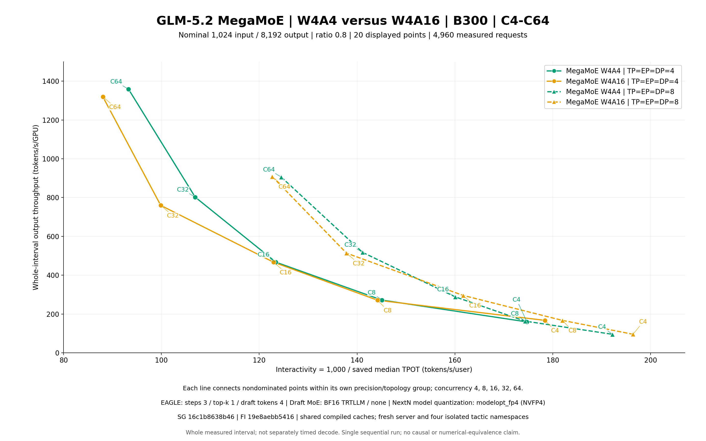

# Pareto view through concurrency 64

This additional view shows the 20 accepted C4/C8/C16/C32/C64 points (4,960 measured requests). It retains W4A4 green and W4A16 orange; EP4 uses solid lines/circles and EP8 dashed lines/triangles. Each of the four frontiers is recomputed within this subset. Coordinates use the same whole-interval output throughput per GPU and inverse saved median TPOT as the complete figure.

The parent result directory and its original 24-point C128 figure are unchanged. Its original FILES.json continues to bind the original publication. This directory has a separate FILES.json for the filtered render payloads.



[Vector SVG](pareto.svg)

From the repository root, using Python with Matplotlib 3.10.6:

```bash
python experimental/glm52_megamoe_1k8k/results/r2-b300-20260924/c64-max/render_cmax64.py \
  --published-dir experimental/glm52_megamoe_1k8k/results/r2-b300-20260924 \
  --output /tmp/glm52-r2-c64-max-reproduced
```

The output directory must not exist. The helper verifies all original selected raw payloads before applying the concurrency filter. Matplotlib/font/platform differences can affect rendering bytes; the selected measurements remain identical. This is a filtered visualization, with no new benchmark or causal claim.
