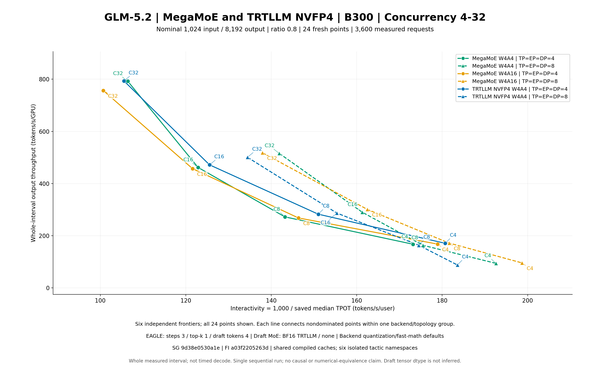

# Fresh six-arm GLM-5.2 1k/8k results

Public scope: compact tables and plots. Full logs, request records and runtime evidence are retained locally; public plot replay uses saved metrics and does not repeat raw-evidence validation. See [reproduction guide](../REPRODUCE.md).

公开范围：汇总表与图表。完整日志、逐请求及运行时证据保留本地；公开绘图不重复原始证据验收。

Verified finalized points: 24/24.

Nominal lengths 1,024/8,192 with ratio 0.8 sampling; 2C warmup / 10C measured. Same-C ordered length arrays match across available arms.

Throughput covers the complete measured wall interval, not separately timed decode. MTP server-state averages include warmup; no global measured acceptance rate is inferred.

| Arm | TP=DP=EP | C | Requests | Duration s | Output tok/s | Output tok/s/GPU | 1000/median TPOT |
|---|---:|---:|---:|---:|---:|---:|---:|
| megamoe-w4a16 | 4 | 16 | 160 | 644.962828 | 1829.500784 | 457.375196 | 121.574510 |
| megamoe-w4a16 | 4 | 32 | 320 | 784.464318 | 3025.711871 | 756.427968 | 100.715867 |
| megamoe-w4a16 | 4 | 4 | 40 | 431.831634 | 672.674203 | 168.168551 | 178.903650 |
| megamoe-w4a16 | 4 | 8 | 80 | 548.620636 | 1072.945423 | 268.236356 | 146.379072 |
| megamoe-w4a16 | 8 | 16 | 160 | 490.044341 | 2407.863738 | 300.982967 | 162.488739 |
| megamoe-w4a16 | 8 | 32 | 320 | 572.680830 | 4144.652438 | 518.081555 | 137.949328 |
| megamoe-w4a16 | 8 | 4 | 40 | 378.513320 | 767.428740 | 95.928593 | 198.692086 |
| megamoe-w4a16 | 8 | 8 | 80 | 427.832819 | 1375.864529 | 171.983066 | 181.637486 |
| megamoe-w4a4 | 4 | 16 | 160 | 638.567204 | 1847.824306 | 461.956077 | 122.871398 |
| megamoe-w4a4 | 4 | 32 | 320 | 749.139597 | 3168.385453 | 792.096363 | 106.438167 |
| megamoe-w4a4 | 4 | 4 | 40 | 433.255591 | 670.463362 | 167.615840 | 173.168372 |
| megamoe-w4a4 | 4 | 8 | 80 | 540.429231 | 1089.208293 | 272.302073 | 143.213109 |
| megamoe-w4a4 | 8 | 16 | 160 | 507.982462 | 2322.836097 | 290.354512 | 161.284956 |
| megamoe-w4a4 | 8 | 32 | 320 | 575.245114 | 4126.176725 | 515.772091 | 141.870030 |
| megamoe-w4a4 | 8 | 4 | 40 | 384.914271 | 754.666745 | 94.333343 | 192.566940 |
| megamoe-w4a4 | 8 | 8 | 80 | 450.015793 | 1308.042982 | 163.505373 | 175.498692 |
| trtllm-w4a4 | 4 | 16 | 160 | 625.387600 | 1886.765904 | 471.691476 | 125.574494 |
| trtllm-w4a4 | 4 | 32 | 320 | 748.049765 | 3173.001464 | 793.250366 | 105.549581 |
| trtllm-w4a4 | 4 | 4 | 40 | 424.411647 | 684.434563 | 171.108641 | 180.716224 |
| trtllm-w4a4 | 4 | 8 | 80 | 520.549895 | 1130.804185 | 282.701046 | 151.007566 |
| trtllm-w4a4 | 8 | 16 | 160 | 513.744641 | 2296.783081 | 287.097885 | 155.337856 |
| trtllm-w4a4 | 8 | 32 | 320 | 592.515622 | 4005.907881 | 500.738485 | 134.440198 |
| trtllm-w4a4 | 8 | 4 | 40 | 412.046435 | 704.973943 | 88.121743 | 183.555203 |
| trtllm-w4a4 | 8 | 8 | 80 | 449.474931 | 1309.616976 | 163.702122 | 174.524806 |

Complete saved scalar latency metrics, source pins and raw SHA bindings are in [raw-metrics.csv](raw-metrics.csv) and [raw-metrics.json](raw-metrics.json). All saved scalar fields are retained in raw-saved-scalars.json/CSV; paired-comparisons.json/CSV uses Decimal50 arithmetic and explicit baseline/comparison case IDs. Zero baselines have no percent change.

The traditional arm uses backend defaults for per-tensor activation and quantization fast math; the W4A16 opt-in also affects eligible dense NVFP4 linears under current defaults; it is not an isolated MoE-only precision change. Draft BF16 describes its MoE path, not every tensor. This reader checks sealed settings and accounting; actual native kernel/tactics/calibration, full terminal and preservation acceptance remain separate reviews.

Saved ITL is stream_interval30 chunk spacing, not per-token TPOT. Sequential backend/topology/cache history differences do not establish causality or numerical/content equivalence. No unsaved percentiles are reconstructed.

