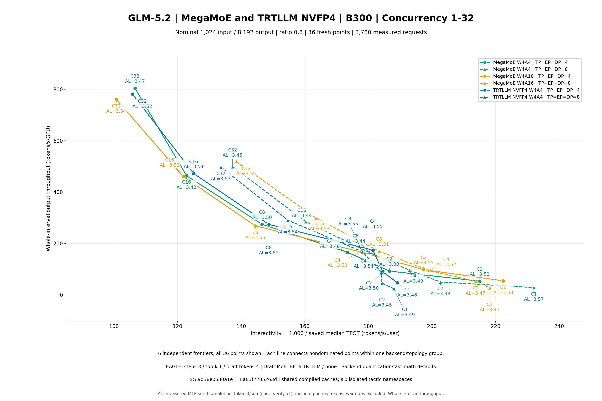

# Fresh six-arm GLM-5.2 1k/8k results

Public scope: compact tables and plots. Full logs, request records and runtime evidence are retained locally; public plot replay uses saved metrics and does not repeat raw-evidence validation. See [reproduction guide](../REPRODUCE.md).

公开范围：汇总表与图表。完整日志、逐请求及运行时证据保留本地；公开绘图不重复原始证据验收。

Verified finalized points: 36/36.

Nominal lengths 1,024/8,192 with ratio 0.8 sampling; 2C warmup / 10C measured. Same-C ordered length arrays match across available arms.

Throughput covers the complete measured wall interval, not separately timed decode. Measured MTP acceptance length is sum(completion_tokens) / sum(spec_verify_ct), including the native bonus token. Every measured request must retain valid native counters; warmups are excluded.

| Arm | TP=DP=EP | C | Requests | Duration s | Output tok/s | Output tok/s/GPU | 1000/median TPOT | Measured MTP AL |
|---|---:|---:|---:|---:|---:|---:|---:|---:|
| megamoe-w4a16 | 4 | 1 | 10 | 340.858650 | 216.823014 | 54.205754 | 222.424197 | 3.577251 |
| megamoe-w4a16 | 4 | 16 | 160 | 641.358530 | 1839.782190 | 459.945547 | 121.868519 | 3.532212 |
| megamoe-w4a16 | 4 | 2 | 20 | 372.981679 | 391.617090 | 97.904273 | 197.400700 | 3.549685 |
| megamoe-w4a16 | 4 | 32 | 320 | 780.452554 | 3041.264952 | 760.316238 | 100.754872 | 3.536914 |
| megamoe-w4a16 | 4 | 4 | 40 | 436.162474 | 665.994938 | 166.498735 | 177.727232 | 3.534919 |
| megamoe-w4a16 | 4 | 8 | 80 | 548.683921 | 1072.821670 | 268.205417 | 144.470576 | 3.549509 |
| megamoe-w4a16 | 8 | 1 | 10 | 342.158640 | 215.999222 | 26.999903 | 218.175950 | 3.427763 |
| megamoe-w4a16 | 8 | 16 | 160 | 493.372735 | 2391.619798 | 298.952475 | 163.496771 | 3.529190 |
| megamoe-w4a16 | 8 | 2 | 20 | 351.003546 | 416.138246 | 52.017281 | 213.766724 | 3.473214 |
| megamoe-w4a16 | 8 | 32 | 320 | 572.253547 | 4147.747118 | 518.468390 | 138.492074 | 3.550713 |
| megamoe-w4a16 | 8 | 4 | 40 | 383.898628 | 756.663292 | 94.582912 | 198.979408 | 3.524155 |
| megamoe-w4a16 | 8 | 8 | 80 | 433.972688 | 1356.398725 | 169.549841 | 183.398286 | 3.505729 |
| megamoe-w4a4 | 4 | 1 | 10 | 349.301159 | 211.582464 | 52.895616 | 215.028909 | 3.515818 |
| megamoe-w4a4 | 4 | 16 | 160 | 636.393256 | 1854.136557 | 463.534139 | 122.839925 | 3.481910 |
| megamoe-w4a4 | 4 | 2 | 20 | 396.307836 | 368.567025 | 92.141756 | 186.632871 | 3.378655 |
| megamoe-w4a4 | 4 | 32 | 320 | 738.017370 | 3216.134332 | 804.033583 | 106.628493 | 3.468124 |
| megamoe-w4a4 | 4 | 4 | 40 | 439.121221 | 661.507543 | 165.376886 | 173.468393 | 3.478535 |
| megamoe-w4a4 | 4 | 8 | 80 | 536.753993 | 1096.666271 | 274.166568 | 146.585159 | 3.498541 |
| megamoe-w4a4 | 8 | 1 | 10 | 330.051708 | 223.922489 | 27.990311 | 232.057217 | 3.568614 |
| megamoe-w4a4 | 8 | 16 | 160 | 517.902839 | 2278.342408 | 284.792801 | 160.316126 | 3.440197 |
| megamoe-w4a4 | 8 | 2 | 20 | 367.743194 | 397.195658 | 49.649457 | 202.696503 | 3.383272 |
| megamoe-w4a4 | 8 | 32 | 320 | 595.156073 | 3988.135394 | 498.516924 | 137.319382 | 3.449395 |
| megamoe-w4a4 | 8 | 4 | 40 | 380.869680 | 762.680820 | 95.335102 | 192.953031 | 3.491664 |
| megamoe-w4a4 | 8 | 8 | 80 | 447.902263 | 1314.215285 | 164.276911 | 180.361423 | 3.441011 |
| trtllm-w4a4 | 4 | 1 | 10 | 394.858913 | 187.170651 | 46.792663 | 189.155246 | 3.483503 |
| trtllm-w4a4 | 4 | 16 | 160 | 624.943656 | 1888.106214 | 472.026553 | 125.074747 | 3.541732 |
| trtllm-w4a4 | 4 | 2 | 20 | 409.955795 | 356.296952 | 89.074238 | 184.559672 | 3.503118 |
| trtllm-w4a4 | 4 | 32 | 320 | 759.755765 | 3124.113181 | 781.028295 | 105.841030 | 3.522872 |
| trtllm-w4a4 | 4 | 4 | 40 | 417.515861 | 695.738837 | 173.934709 | 181.439869 | 3.553949 |
| trtllm-w4a4 | 4 | 8 | 80 | 537.273714 | 1095.605433 | 273.901358 | 148.710849 | 3.510433 |
| trtllm-w4a4 | 8 | 1 | 10 | 393.207289 | 187.956841 | 23.494605 | 188.077365 | 3.485474 |
| trtllm-w4a4 | 8 | 16 | 160 | 508.218318 | 2321.758109 | 290.219764 | 154.693416 | 3.542540 |
| trtllm-w4a4 | 8 | 2 | 20 | 405.035695 | 360.625006 | 45.078126 | 184.316476 | 3.451139 |
| trtllm-w4a4 | 8 | 32 | 320 | 596.677898 | 3977.963671 | 497.245459 | 133.641775 | 3.525373 |
| trtllm-w4a4 | 8 | 4 | 40 | 411.149089 | 706.512571 | 88.314071 | 184.092342 | 3.536383 |
| trtllm-w4a4 | 8 | 8 | 80 | 438.907080 | 1341.149475 | 167.643684 | 178.128864 | 3.553559 |

Complete saved scalar latency metrics, source pins and raw SHA bindings are in [raw-metrics.csv](raw-metrics.csv) and [raw-metrics.json](raw-metrics.json). All saved scalar fields are retained in raw-saved-scalars.json/CSV; paired-comparisons.json/CSV uses Decimal50 arithmetic and explicit baseline/comparison case IDs. Zero baselines have no percent change.

The TRTLLM NVFP4 arm supplies no custom per-token-scaling or quantizer-math override. Its selected SGLang helper omits the backend argument; pinned FlashInfer fp4_quantize defaults to CUDA and calls fp4_quantize_sm100 through the SM103 module. CuTeDSL-only math flags do not establish the selected CUDA path’s reciprocal or approximation behavior; no such low-level math claim is made. Fixed checkpoint global scale and runtime vector16 E4M3 block scales are established separately. The W4A16 opt-in also affects eligible dense NVFP4 linears under current defaults; it is not an isolated MoE-only precision change. Draft BF16 describes its MoE path, not every tensor. This reader checks sealed settings and accounting; actual native kernel/tactics/calibration, full terminal and preservation acceptance remain separate reviews.

Saved ITL is stream_interval30 chunk spacing, not per-token TPOT. Sequential backend/topology/cache history differences do not establish causality or numerical/content equivalence. No unsaved percentiles are reconstructed.

Case C17 (MegaMoE W4A16, TP=EP=DP4, C8) retained post-case GPU memory [4231, 236413, 4426, 2170, 0, 0, 0, 0] MiB at 2026-09-30T16:16:37Z, with zero utilization and an empty subsequent application query. The producer checks eight GPU rows and no reported applications; the GPU and application queries are sequential. Acceptance under that predicate does not establish zero-memory, atomic or continuous idle, current idle, a causal explanation, or eventual reclamation. Leader exit 0 also does not establish every child exited gracefully.
